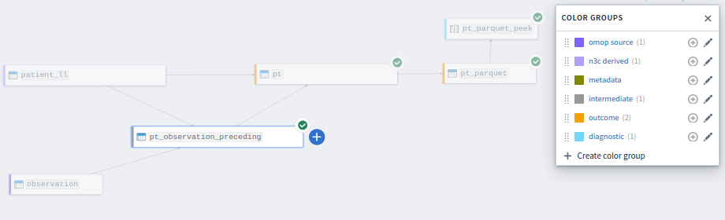

# Data Extraction & Assembly with Synthetic Data

Feb 1, 2024

Combining multiple OMOP tables into a single R data frame that can be
analyzed.

This is part of the [Analysis with Synthetic Data](../) session.

## Important Terminology for this Lesson

- *table grain*: what one row in a table represents. For example, the
  grain of the
  [`person`](https://ohdsi.github.io/CommonDataModel/cdm60.html#PERSON)
  table is "person"; each row represents one distinct person/patient.
  Similarly, the grain of the
  [`visit_occurrence`](https://ohdsi.github.io/CommonDataModel/cdm60.html#VISIT_OCCURRENCE)
  table is "visit"; each row represents one distinct visit/encounter the
  patient had with the health system..

## Session's Expectations

1.  Try to follow along, but not everyone can finish at the speed of the lecture.
1.  If you have questions, please ask them in the chat.
1.  For questions that are generalizable to the group,
    the instructors will elevate it and I'll address it directly.
1.  When I'm done today, we'll answer your questions as long as we have time.
1.  Finish on your own time after today's session.
1.  Come to office hours for remaining obstacles or more detailed questions.

## !! Real Analyses Must be Approved to Leave the Enclave !!

  

If you're following this document outside of class,
don't forget all analytical output (like tables, graphs, models, & screenshots)
*must be approved* before it's exported from the Enclave.
We'll discuss details later in Session 6.

Remember Session 3 uses only synthetic/fake data.
Therefore no patients can potentially be exposed by this handout.

But when you start working with real Level 2 or Level 3 data,
you must follow the procedures described in
[Session 6](https://github.com/National-COVID-Cohort-Collaborative/short-course-2024-january/tree/main/sessions/session-6#readme) and
the [Publishing and Sharing Your Work](https://national-covid-cohort-collaborative.github.io/guide-to-n3c-v1/chapters/publishing.html) chapter of [*G2N3C*](https://national-covid-cohort-collaborative.github.io/guide-to-n3c-v1/).

  

## Open the "manipulation-1" Code Workbook in the Foundry Enclave

Open `manipulation-1` workbook in your personal directory.
You should have created it already in the
[assignments leading into Session 3](../homework#create-the-manipulation-1-code-workbook).

## Challenge for Today's Session –1st Try

- Investigate the observational relationship between covid outcomes and

  - pecked by chicken, initial encounter
    ([W61.33XA](https://www.icd10data.com/ICD10CM/Codes/V00-Y99/W50-W64/W61-/W61.33XA))
    <!--* pecked by chicken, subsequent encounter ([W61.33XD](https://www.icd10data.com/ICD10CM/Codes/V00-Y99/W50-W64/W61-/W61.33XD))-->
  - struck by a chicken, initial encounter
    ([W61.32XA](https://www.icd10data.com/ICD10CM/Codes/V00-Y99/W50-W64/W61-/W61.32XA))
  - struck by a duck, initial encounter
    ([W61.62XA](https://www.icd10data.com/ICD10CM/Codes/V00-Y99/W50-W64/W61-/W61.62XA))
    <!--* struck by a duck, subsequent encounter ([W61.62XD](https://www.icd10data.com/ICD10CM/Codes/V00-Y99/W50-W64/W61-/W61.62XD))-->

  
  

- In OMOP, ICD codes are translated to SNOMED codes (as we discussed in Session 2), and can lose some
  granularity/fidelity.

  | ICD<br>Description    | SNOMED<br>Description     |                                                OMOP Concept ID<br>(OMOP Domain) |
  |:----------------------|:--------------------------|--------------------------------------------------------------------------------:|
  | "pecked by chicken"   | "Peck by bird"            | [4314097](https://athena.ohdsi.org/search-terms/terms/4314097)<br>(Observation) |
  | "struck by a chicken" | "Contact with chicken"    | [1575676](https://athena.ohdsi.org/search-terms/terms/1575676)<br>(Observation) |
  | "struck by a duck"    | "Injury caused by animal" | [438039](https://athena.ohdsi.org/search-terms/terms/438039)<br>(Condition) |

## Challenge for Today's Session –2nd Try

- Talk to PI and revise hypothesis so it can be addressed by an OMOP dataset.

- The group decides to step back and address the associations of being pecked or butted

  | SNOMED<br>Description |                                                OMOP Concept ID<br>(OMOP Domain) |
  |:----------------------|--------------------------------------------------------------------------------:|
  | "Peck by bird"        | [4314097](https://athena.ohdsi.org/search-terms/terms/4314097)<br>(Observation) |
  | "Butted by animal"    | [4314094](https://athena.ohdsi.org/search-terms/terms/4314094)<br>(Observation) |

* Some more nuanced details of farm life interactions will be postponed until subsequent investigations.

  <a href="https://www.etsy.com/listing/1267137036/anatomy-of-a-goose-poster-bathroom-decor"></a>


**Resources**

- [ICD10CM codes for Contact with birds (domestic) (wild)](https://www.icd10data.com/ICD10CM/Codes/V00-Y99/W50-W64/W61-#W61.33)

## Inclusion & Exclusion Criteria

1.  Work with the investigators to keep an updated list of the characteristics
    that make a patient eligible to be included in the analysis.

1.  For today, we'll specify ~2 eligibility criteria:

    1.  Include patients only if 2+ years old at the time of covid onset.
        (Or if age is unknown.)
    1.  Exclude patients if they first develop covid before July 1, 2020.
        (Or if onset date is unknown.)
    1.  Exclude patients if they first develop covid after Dec 31, 2022.

1.  I like to include the criteria in the `pt` transform,
    which will be one of the final steps in the workbook.
    Basically calculate the picture for everyone, and then make the decision at the end.

    I don't like the criteria to be scattered across 3+ transforms.

1.  It may be less computationally efficient in some cases to scatter,
    but I think this approach makes it easier to spot misspecifications.

## Identify Source Tables & their Relationships

- In most EHR research, conceptually start with the database's patient tablet.
  With OMOP, this table is called
  [`person`](https://ohdsi.github.io/CommonDataModel/cdm60.html#PERSON).

- But with N3C, a talented group of people have faced and addressed many of the problems we'll face.
  So let's leverage the [Logic Liaisons'](https://covid.cd2h.org/liaisons/)
  contributions to the N3C Knowledge Store.

**Resources**

- [OMOP Table Structure](https://ohdsi.github.io/CommonDataModel/cdm60.html#Clinical_Data_Tables)
- Logic Liaison Fact Tables
  - [COVID-19 Diagnosed or Lab Confirmed Patients](https://unite.nih.gov/workspace/module/view/latest/ri.workshop.main.module.3ab34203-d7f3-482e-adbd-f4113bfd1a2b?id=KO-BE5C652&view=focus)
  - [Combined Variables ALL PATIENTS](https://unite.nih.gov/workspace/module/view/latest/ri.workshop.main.module.3ab34203-d7f3-482e-adbd-f4113bfd1a2b?id=KO-DE908D4&view=focus)
- [*The Researcher's Guide to N3C*](https://national-covid-cohort-collaborative.github.io/guide-to-n3c-v1/)
  - [Section 8.3.3 Logic Liaison Fact Tables and Templates](https://national-covid-cohort-collaborative.github.io/guide-to-n3c-v1/chapters/tools.html#sec-tools-store-ll0)

## Sketch Plan

## Select Input Datasets

1.  Click the blue "Import dataset" button.
1.  Go to the directory for this class's L0 DUR: "All \> All projects \>
    N3C Training Area \> Group Exercises \> Introduction to Real World
    Data Analysis for COVID-19 Research, Spring 2024"
1.  Go to the directory that has the simulated for today's session:
    "analysis-with-synthetic-data"
1.  Hold \[shift\], click `observation` and `patient_ll`,
    and click the blue "Select" button.

Notes:

1.  The simulated `observation` table mimics OMOP's
    [`observation`](https://ohdsi.github.io/CommonDataModel/cdm60.html#OBSERVATION) table.
1.  The simulated `patient_ll` table mimics the Logic Liaison's
    [`LOGIC_LIAISON_Covid_19_Patient_Summary_Facts_Table_LDS_`](https://unite.nih.gov/workspace/module/view/latest/ri.workshop.main.module.3ab34203-d7f3-482e-adbd-f4113bfd1a2b?id=KO-BE5C652&view=focus)
    table.

## Create the First SQL Transform: Isolate Relevant Animal Event

1.  Click the `patient_ll` transform, then click the blue plus button,
    then select "SQL code".

1.  Click the gray plus button (above the code), and click the `observation` transform.

1.  Change the new transform's name from "unnamed" to `pt_observation_preceding`.

1.  Click "Save as dataset", so it's toggled blue.

1.  A 2nd name pops up for the transform.
    Keep the pair of names consistent (eg, `pt_observation_preceding` also).

1.  Verify that you have two inputs: `patient_ll` & `observation`. The
    colors are orange & purple, but the order doesn't matter.

1.  Replace the code in the " Logic" panel with

    ``` sql
    WITH obs_before as (
      SELECT
        o.observation_id
        ,o.person_id
        ,o.observation_concept_id
        -- This case-when block recodes the concept ids into words.
        --   In a real project, consider using a concept set
        --   or joining to a metadata table.
        ,case
          when o.observation_concept_id = 4314094 then 'Butted by animal'
          when o.observation_concept_id = 4314097 then 'Peck by bird'
          else                                         'Error: concept not classified'
        end                                         as event_animal
        ,o.observation_date
        ,p.covid_date
        -- Calculate the days between the event and the subsequent covid dx.
        ,datediff(p.covid_date, o.observation_date) as dx_days_before_covid
        -- Within a pt, create a reverse sequence of ...4, 3, 2, & 1.
        --   The "1" will be the most recent event before the covid dx.
        ,row_number() over (partition by p.person_id order by o.observation_date desc) as index_within_pt_rev
      FROM patient_ll p
        -- Take only the patients with a relevant concept id.
        inner join observation o on p.person_id = o.person_id
      WHERE
        -- Take only events that occur before the covid dx.
        o.observation_date < p.covid_date
        and
        -- This block is typically replaced by a reference to a concept set.
        --   Concept sets were covered in Session 2.
        o.observation_concept_id in (
          4314094,
          4314097
        )
    )

    -- Take only the relevant columns.
    --   Take only the event immediately before the covid dx.
    SELECT
      observation_id
      ,person_id
      ,observation_concept_id
      ,event_animal
      ,observation_date
      ,dx_days_before_covid
    FROM obs_before
    WHERE index_within_pt_rev = 1
    ```

1.  Click blue "Run" button.

1.  Verify resulting table has 6 columns & 679 rows.

1.  Notice `pt_observation_preceding` has fewer rows than `patient_ll`.

    - Q1: Why?
    - Q2: Can we use `pt_observation_preceding` directly in the analysis? Why not?
    - Q3: What rows are missing from `pt_observation_preceding`,
      and how can we fill in those rows?
    - Q4: Suppose the investigators don't want ancient events.
      ...say only the previous 6 months are relevant.
      Conceptually, how would we modify the query?

## Dissecting Previous SQL Code

1.  `SELECT` clause
1.  `FROM` clause
1.  `inner join` operator
1.  `case when` statement
1.  `row_number()` function
1.  `o.observation_concept_id` in `WHERE` clause
1.  `obs_before` CTE
1.  Second `SELECT` & `FROM` statements
1.  `WHERE index_within_pt_rev = 1`

## Create the Second SQL Transform: Rejoin with `patient_ll`

1.  Go back to this table to get

    1.  ...patients that didn't have a documented animal event.
    1.  ...useful variables the logic liaisons calculated for us.

1.  Click the `patient_ll` transform, then click the blue plus button,
    then select "SQL code" (again).

1.  Click the gray plus button (above the code), and click the
    `observation` transform.

1.  Change the new transform's name from "unnamed" to `pt`.

1.  Click "Save as dataset", so it's toggled blue.

1.  A 2nd name pops up for the transform.
    Keep the pair of names consistent (eg, `pt` also).

1.  Verify that you have two inputs: `patient_ll` & `pt`.
    The colors are orange & purple, but the order doesn't matter.

1.  Replace the code in the " Logic" panel with

    ``` sql
    SELECT
      p.person_id
      ,p.data_partner_id
      ,p.covid_date
      ,p.covid_severity
      -- ,p.calc_outbreak_lag_years -- There will be some LL columns that won't be relevant to us
      ,p.calc_age_covid
      ,p.length_of_stay
      ,po.event_animal
      ,po.dx_days_before_covid
    FROM patient_ll p
      left  join pt_observation_preceding po on p.person_id = po.person_id
    ```

1.  Click blue "Run" button.

1.  Verify resulting table has 8 columns & 1000 rows.

1.  Notice `pt` and `patient_ll` have the same record count.

    - Q1: Why?
    - Q2: If `pt` had *more* records than `patient_ll`, what went wrong?
    - Q3: If `pt` had *fewer* records than `patient_ll`, what went
      wrong?

## Improve `pt` transform

1.  Writing code can be hard. Starting with complex code is almost always slower.

1.  Start simple.  Gradually add complexity.

1.  Replace the code in the " Logic" panel with

    ``` sql
    SELECT
      -- Sequence of 1, 2, 3, 4, ... across patients
      cast(row_number() over (order by p.person_id) as int)     as pt_index
      --,p.person_id
      ,p.data_partner_id
      ,p.covid_date
      ,p.calc_age_covid
      ,p.length_of_stay
      -- If `po.event_animal` return 'No event documented'.
      ,coalesce(po.event_animal, 'No event documented')         as event_animal
      ,po.dx_days_before_covid
      -- Bin the dates into 6-month levels
      ,case
        when p.covid_date is null         then null
        when p.covid_date <= '2019-12-31' then 'too early'
        when p.covid_date <= '2020-06-30' then '2020H1'
        when p.covid_date <= '2020-12-31' then '2020H2'
        when p.covid_date <= '2021-06-30' then '2021H1'
        when p.covid_date <= '2021-12-31' then '2021H2'
        when p.covid_date <= '2022-06-30' then '2022H1'
        when p.covid_date <= '2022-12-31' then '2022H2'
        when p.covid_date <= '2023-06-30' then '2023H1'
        when p.covid_date <= '2023-12-31' then '2023H2'
        else                                   'error'
      end                                                      as period_first_covid_dx
      -- Bin the age into 5 legit levels.
      ,case
        when p.calc_age_covid is null then 'Unknown'
        when p.calc_age_covid < 0     then 'Unknown'
        when p.calc_age_covid < 2     then 'Too Young'
        when p.calc_age_covid < 19    then '2-18'
        when p.calc_age_covid < 51    then '19-50'
        when p.calc_age_covid < 76    then '51-75'
        else                               '76+'
      end                                                      as age_cut5
      ,p.covid_severity
      ,case
        when p.covid_severity = 'none'      then false
        when p.covid_severity = 'mild'      then true
        when p.covid_severity = 'moderate'  then true
        when p.covid_severity = 'severe'    then true
        when p.covid_severity = 'death'     then true
        else                                     null
      end                                                      as covid_mild_plus
      ,case
        when p.covid_severity = 'none'      then false
        when p.covid_severity = 'mild'      then false
        when p.covid_severity = 'moderate'  then true
        when p.covid_severity = 'severe'    then true
        when p.covid_severity = 'death'     then true
        else                                     null
      end                                                      as covid_moderate_plus
      ,case
        when p.covid_severity = 'none'      then false
        when p.covid_severity = 'mild'      then false
        when p.covid_severity = 'moderate'  then false
        when p.covid_severity = 'severe'    then true
        when p.covid_severity = 'death'     then true
        else                                     null
      end                                                      as covid_severe_plus
      ,case
        when p.covid_severity = 'none'      then false
        when p.covid_severity = 'mild'      then false
        when p.covid_severity = 'moderate'  then false
        when p.covid_severity = 'severe'    then false
        when p.covid_severity = 'death'     then true
        else                                     null
      end                                                      as covid_dead
    FROM patient_ll p
      -- A left join will retain all rows from `patient_ll`,
      --   even those without an event.
      left  join pt_observation_preceding po on p.person_id = po.person_id
    WHERE
      -- Must be 2+ years old at covid dx
      2 <= p.calc_age_covid
      and
      -- covid dx must be within this time window
      p.covid_date between '2020-07-01' and '2022-12-31'
    ```

1.  Click blue "Run" button.

1.  Notice we added inclusion criteria (in the WHERE clause) and
    more variables (in the SELECT clause).

1.  Why do we have fewer records than in the previous iteration of this transform?
    Is this drop reasonable?

1.  Even if the drop seems reasonable and the cause seems obvious to you,
    please make a note of this and notify the investigators at the next meeting.
    They need to feel their decisions as much as possible.

## Strategies for Organizing Transforms

1.  The `pt_observation_preceding` and `pt` transforms could be combined into one transform
1.  Pros for splitting into well-designed segments that are eventually assembled.
    1.  Human mind is better an reasoning through one focused piece at a time.
        Development is easier.
        Communication to teammates is easier (especially if different grains are involved).
    1.  Easier to modify later.
    1.  Database engines can better optimize.
        This is particularly true for non-N3C databases you might use,
        like SQL Server, Oracle, Postgres, DuckDB.
1.  Cons for splitting
    1.  Requires more time if you copy & paste code somewhere.

## Beauty of CTEs

1.  A [Common Table Expression](https://www.atlassian.com/data/sql/using-common-table-expressions)
    (CTE) allows you to write sql code that's mode top-to-bottom, and less inside-out.

1.  Similar cognitive as breaking up complicated monolithic transforms/queries into smaller ones.

1.  "Subquery style"

    ``` sql
    SELECT
      observation_id
      ,person_id
      ,observation_concept_id
      ,event_animal
      ,observation_date
      ,dx_days_before_covid
    FROM (
      ...(contents of CTE)...
    ) obs_before
    WHERE index_within_pt_rev = 1
    ```

1.  "CTE style":

    ``` sql
    WITH obs_before as (
      ...(contents of CTE)...
    )
    SELECT
      observation_id
      ,person_id
      ,observation_concept_id
      ,event_animal
      ,observation_date
      ,dx_days_before_covid
    FROM obs_before
    WHERE index_within_pt_rev = 1
    ```

## Global Code

1.  The [Global Code](https://www.palantir.com/docs/foundry/code-workbook/workbooks-global-code/)
    (in a right-hand panel),
    lets us define variables and functions that are available in all code transforms *in the workbook*
    (not the workspace).
    In today's "manipulation-1" workbook, we'll define constants and define helper functions.

1.  Global Code is essentially copy and pasted before each R transform is executed.

1.  We recommend that Global Code *defines* functions,
    but does not *call/execute* functions.
    In other words, define functions that R transforms can later execute.

1.  Paste following into the R tab of the Global Code panel.

    ``` r
    load_packages <- function () {
      # Load all fxs within these packages
      # library(magrittr) # If R <4.1
      # Throw an error if one of these packages are missing
      requireNamespace("arrow")
      requireNamespace("dplyr")
      requireNamespace("tidyr")
    }

    # ---- Code Specific to this Workbook -----------
    prepare_dataset <- function(d) {
      d |>
        tibble::as_tibble() |>
        dplyr::mutate(
          # Custom 'factor_*' functions are defined below
          data_partner_id        = factor(data_partner_id),
          period_first_covid_dx  = factor_period(period_first_covid_dx),
          covid_severity         = factor_severity(covid_severity),
          age_cut5               = factor_age(age_cut5),
          event_animal           = factor_event_animal(event_animal),
        ) |>
        dplyr::mutate(
          # gender_male            = as.integer(gender_male),
          # smoking_ever           = as.integer(smoking_ever),
          covid_mild_plus        = as.integer(covid_mild_plus),
          covid_moderate_plus    = as.integer(covid_moderate_plus),
          covid_severe_plus      = as.integer(covid_severe_plus),
          covid_dead             = as.integer(covid_dead),
        )
    }
    factor_event_animal <- function (x) {
      factor(
        x,
        levels = c(
          "No Event Documented", # Reference level for models
          "Butted by animal",
          "Peck by bird"
        )
      )
    }
    factor_period <- function (x) {
      factor(
        x,
        levels = c(
          # "2020H1",
          "2020H2",
          "2021H1", "2021H2",
          "2022H1", "2022H2"
        )
      )
    }
    factor_severity <- function(x) {
      factor(
        x,
        levels = c(
          "none",
          "mild",
          "moderate",
          "severe",
          "death"
        )
      )
    }
    factor_age <- function(x) {
      factor(
        x,
        levels = c(
          "2-18",
          "19-50",
          "51-75",
          "76+"
        )
      )
    }

    # ---- Asserts -----------
    # These functions try to return helpful error messages for misspecifications
    assert_r_data_frame <- function(x) {
      if (!inherits(x, "data.frame")) {
        stop("The dataset is not an 'R data.frame`; convert it.")
      }
    }
    assert_spark_data_frame <- function(x) {
      if (!inherits(x, "SparkDataFrame")) {
        stop("The dataset is not a 'SparkDataFrame`; convert it.")
      }
    }
    assert_transform_object <- function(x) {
      if (!inherits(x, "FoundryTransformInput")) {
        stop("The dataset is not a 'FoundryTransformInput`; convert it.")
      }
    }

    # ---- IO --------------
    # Convert between R data.frames and parquet files.
    to_parquet <- function(d, assert_data_frame = TRUE) {
      if (assert_data_frame) assert_r_data_frame(d)
      output    <- new.output()
      output_fs <- output$fileSystem()
      arrow::write_parquet(
        x    = d,
        sink = output_fs$get_path("parquet", 'w')
      )

      stat <-
        sprintf(
          "%i_cols-by-%.1f_krows",
          ncol(d),
          nrow(d) / 1000
        )
      # Write a dummy dataset with a meaningful file name.
      write.csv(mtcars, output_fs$get_path(stat, 'w'))
    }
    from_parquet <- function(node) {
      fs   <- node$fileSystem()
      path <- fs$get_path("parquet", 'r')
      arrow::read_parquet(path)
    }
    ```

1.  Some broad-strokes remarks:

    1.  `load_packages()` has two purposes:
        (a) concisely document to humans what packages should be available in the environment and
        (b) produce clear error messages if an R package isn't available.

## Create R Transform `pt_parquet`

1.  We'll cover R code later in the session.
    For now, just copy some code into a new R transform to make things easier later.

1.  Click the `pt` transform, then click the blue plus button, then select "R code"

1.  In the input list, select `pt` and change it from "R data.frame" to
    "Spark dataframe".
    We'll explicitly convert it with code.

1.  Find a collapsed panel in the lower right corner of the Console called "Variables".
    Change `pt` from "R data.frame" to "Spark dataframe".

1.  Periodically check that these last two settings don't revert back to their original settings.
    Especially if something is weird later.

1.  Paste in the following code.
    You don't have to understand each line yet.
    Big picture: it adds R flavoring that facilitates analyses
    and converts the Spark Dataframe to a file that preserves the flavors.

    ``` r
    pt_parquet <- function(pt) {
      load_packages()               # Defined in Global Code
      assert_spark_data_frame(pt)   # Make sure it's specified correctly

      # ---- retrieve -----------------
      ds <-
        pt |>
        SparkR::arrange("pt_index") |>   # Sort by the index
        SparkR::collect() |>             # Cross from Spark to the R world
        tibble::as_tibble() |>           # Slight improvement
        prepare_dataset()                # Defined in Global Code

      # ---- verify-values -----------------
      nrow(ds)                           # Peek at row count
      dplyr::n_distinct(ds$pt_index)     # Peek at pt count

      # ---- persist -----------------
      ds |>
        to_parquet()                     # Defined in Global Code
    }
    ```

1.  Toggle the "Save as dataset" on.

1.  A 2nd name pops up for the transform.
    Keep the pair of names consistent (eg, `pt_parquet` also).

1.  Click blue "Run" button.

## Two Ways to Run a Transform

1.  Click the blue Run/Preview like we have.

    This is the real way of doing it, and the resulting product is saved.

1.  Select the code you want to execute, and click [ctrl + shift + enter].

    This is how you can debug small sections of code and iteratively develop focused sections faster.

    This runs code in the "Console" panel, which acts kinda independently.

    Note that the first time you run something in the console,
    execute `load_packages()` by itself.

## Peek at Retrieved parquet file

1.  Create an R transform downstream of `pt_parquet`.

1.  Follow the previous steps, but:

    1.  Change the type to "R transform" (instead of "Spark dataframe").
    1.  Don't save the dataset. The Preview mode is adequate for our diagnostic needs.

1.  Paste in the following code:

    ``` r
    pt_parquet_peek <- function(pt_parquet) {
      load_packages()
      assert_transform_object(pt_parquet)

      pt_parquet |>
        from_parquet()     # Defined in Global Code
    }
    ```

1.  Click blue "Preview" button.

1.  Verify the operation was successful and the columns look right.

1.  In the preview mode, only the top 50 records are returned.

## Benefits of a Parquet File

1.  The `pt` transform has one row per patient and will be the dataset
    used in all downstream analyses in this session.
    (Hint, color code it as an "outcome" node in tonight's assignment.)
1.  We'll later benefit if we spend some time now to create an
    analysis-minded dataset.
1.  A few analysis tasks benefit by adding decorations to a Spark table.
    that has several benefits:
    1.  [R factors](https://r4ds.hadley.nz/factors.html) are important
        when the analysis models include categorical variables
        (eg, `covid_severity`).
    1.  R factors designate that a number should be treated like a category
        (eg, `data_partner_id`)
    1.  It's kinda expensive translating a Spark
        [DataFrame](https://spark.apache.org/docs/latest/sql-programming-guide.html)
        into an [R
        data.frame](https://www.r-tutor.com/r-introduction/data-frame).
        Do this once, and recall the saved data.frame in later
        workbooks.
    1. parquet files can be read quickly by R, Python, & Spark consumers.
1.  One line of code restores the data.frame exactly as it was saved.
    You don't have to specify the variables' data types or the factor levels.
1.  An [rds](https://stat.ethz.ch/R-manual/R-devel/library/base/html/readRDS.html)
    file is similar to a parquet file.
    It is a saved/serialized/persisted data.frame.
1.  A parquet file has all the benefits of an "rds" file,
    but can be easily fed to Spark or Python code downstream.

**References**

- [Specify Reference Factor Level in Linear Regression in
  R](https://statisticsglobe.com/specify-reference-factor-level-in-linear-regression-in-r)

## Remarks on Architecture

* Martin Fowler defines *software architecture* as ["things that people perceive as hard to change (later)."](https://martinfowler.com/ieeeSoftware/whoNeedsArchitect.pdf).

* For my approach to N3C workflows, the definition is roughly,

  > deciding when and where to
  > 1. combine tables,
  > 1. apply filters, and
  > 1. save & retrieve intermediate output.

* My goals are
  1.  What's easiest to communicate to humans
  1.  What's easiest to isolate & identify my mistakes
  1.  What's most efficient for the computer to process

## Remarks on Architecture *within a Workbook*

1.  One grain at a time
1.  One concept at a time
1.  Where do you want manhole covers to peek inside the pipeline?
1.  Make things as independent as possible.
    If you need to change something here, ideally nothing over there needs to change.
1.  Don't be timid about identifying confusing parts and rearranging to make the flow more clear.

## Remarks on Architecture *between Workbooks*

1.  Each workbook reflects a distinct phase of the project.
1.  Don't replicate much code across workbooks.
    If so, consider moving that transformation upstream
    so all the downstream workbooks can leverage it.
1.  Use SQL or PySpark for the the high-volume manipulations to produce a small-ish dataset to be analyzed.
1.  Use R or Python to analyze.

## Troubleshooting Tips

1.  This error probably means you need to remind the Enclave that input data frame is a Spark DataFrame:

    ```
    >  Error in function (classes, fdef, mtable) :
    unable to find an inherited method for function 'arrange' for signature '"data.frame", "character"'

    >  traceback:
    >  pt %>% SparkR::arrange("pt_index")
    >  ...
    ```

1.  This error probably means you need to remind the Enclave that input data frame is a Transform input:

    ```
    ```

    In other words, there is nothing written to the Logs.
    Click on the red "Failed" exclamation icon to see something like

    ```
    No schema found for dataset

    A schema could not be found for dataset ri.foundry.main.dataset.9d73cfce-77fd-43bd-80af-e879ea84476b. Confirm the input dataset was built and contains a valid schema.

    Details:

    Executing job failed.
    Error: Failed to extract input.: {recordId=..., inputTableAlias=pt_parquet}
    com.palantir.logsafe.exceptions.SafeRuntimeException: Failed to extract input.:
    ```

1.  If you modify the Global Code, either

    1.  Click the "Reset console" button or
    1.  Paste it in the console so it's available to your code.

1.  If you aren't on R 4.1+ (specified in the Environment),
    you'll need to replace use magrittr pipes instead of native pipes
    (ie, change `|>` to `%>%` and execute `library(magrittr)` in `load_packages()`.)


## Transforms within `manipulation-1`

If you followed this document, your workbook will resemble this image.

[](images/manipulation-1.png)

## Extra Code

Here are some snippets that we won't need for this session,
but may be helpful in your projects.

--none so far--

## Resources

* Palantir Foundry Documentation
  * [R transforms](https://unite.nih.gov/docs/foundry/code-workbook/workbooks-languages/#r-transforms)
  * [Conversion between Spark and R dataframes](https://unite.nih.gov/docs/foundry/code-workbook/workbooks-languages/#conversion-between-spark-and-r-dataframes)
  * [R troubleshooting](https://unite.nih.gov/docs/foundry/code-workbook/workbooks-languages/#r-troubleshooting)
