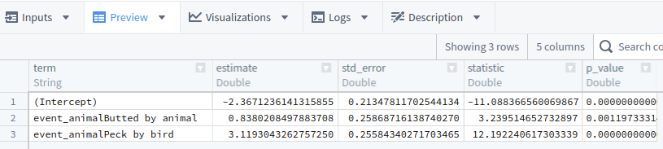
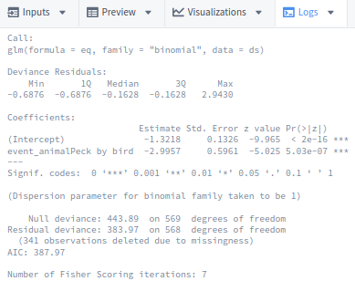
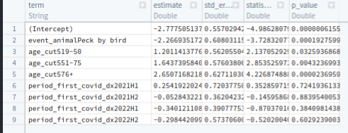
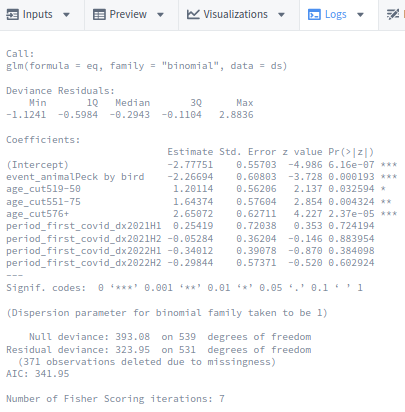
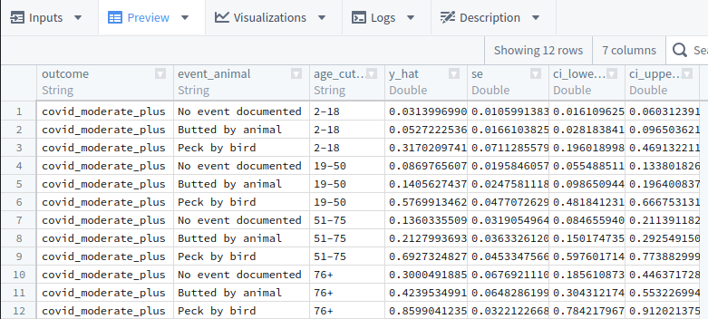
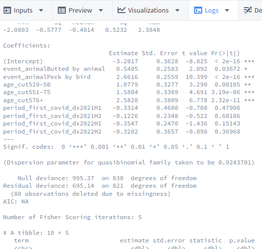
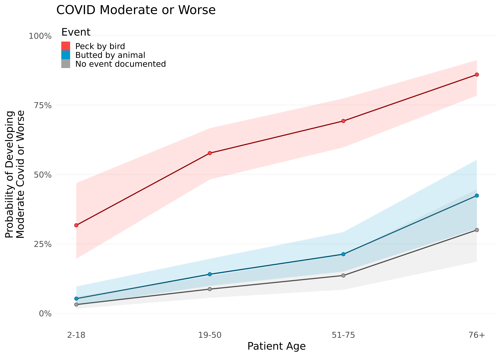
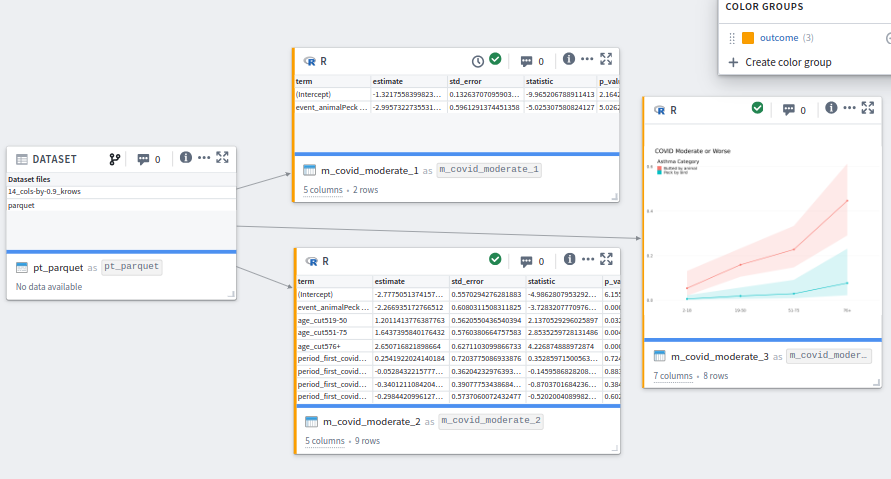

Data Modeling with Synthetic Data
================

This is part of the [Analysis with Synthetic Data](../) session.

## Expectations for the Modeling Lesson

## !! Real Analyses Must be Approved to Leave the Enclave !!

  

If you're following this document outside of class,
don't forget all analytical output (like tables, graphs, models, & screenshots)
*must be approved* before it's exported from the Enclave.
We'll discuss details later in Session 6.

Remember Session 3 uses only synthetic/fake data.
Therefore no patients can potentially be exposed by this handout.

But when you start working with real Level 2 or Level 3 data,
you must follow the procedures described in
[Session 6](https://github.com/National-COVID-Cohort-Collaborative/short-course-2024-january/tree/main/sessions/session-6#readme) and
the [Publishing and Sharing Your Work](https://national-covid-cohort-collaborative.github.io/guide-to-n3c-v1/chapters/publishing.html) chapter of [*G2N3C*](https://national-covid-cohort-collaborative.github.io/guide-to-n3c-v1/).

  

## Open the "modeling-1" Code Workbook in the Foundry

That you created already in the [assignments leading into Session 3](../homework#create-the-graphs-1-code-workbook).

## Select `pt_parquet` as Input Dataset

1.  Click the blue "Import dataset" button.
1.  Go to the directory for this class's L0 DUR: "All \> All projects \>
    N3C Training Area \> Group Exercises \> Introduction to Real World
    Data Analysis for COVID-19 Research, Spring 2024"
1.  Go to the "Users" directory.
1.  Go to your personal directory.
1.  Go to "workbook-output/manipulation-1/" directory.
1.  Select `pt_parquet`.

## Global Code

1.  See the Global Code explanation in the
    [data extraction](../extraction#readme) part of today's session.

1.  Paste following into the R tab of the Global Code panel.

    ``` r
    load_packages <- function () {
      # Load all fxs within these packages
      library(ggplot2)
      # library(magrittr) # If R <4.1
      # Throw an error if one of these packages are missing
      requireNamespace("arrow")
      requireNamespace("dplyr")
      requireNamespace("broom")
    }

    # ---- Code Specific to this Workbook -----------
    # CC0 palette from http://colrd.com/palette/50906/
    # These left-hand labels must exactly match the factor levels (case-sensitive)
    palette_event_dark   <-
      c(
        "Butted by animal"    = "#004c66",
        "Peck by bird"        = "#7f0000",
        "No Event Documented" = "#3f3f3f"
      )

    palette_event_light  <-
      c(
        "Butted by animal"    = "#0099cc",
        "Peck by bird"        = "#ff4444",
        "No Event Documented" = "#a1a1a1"
      )

    # ---- Asserts -----------
    # These functions try to return helpful error messages for misspecifications
    assert_r_data_frame <- function(x) {
      if (!inherits(x, "data.frame")) {
        stop("The dataset is not an 'R data.frame`; convert it.")
      }
    }
    assert_spark_data_frame <- function(x) {
      if (!inherits(x, "SparkDataFrame")) {
        stop("The dataset is not a 'SparkDataFrame`; convert it.")
      }
    }
    assert_transform_object <- function(x) {
      if (!inherits(x, "FoundryTransformInput")) {
        stop("The dataset is not a 'FoundryTransformInput`; convert it.")
      }
    }

    # ---- IO --------------
    # Convert between R data.frames and parquet files.
    to_parquet <- function(d, assert_data_frame = TRUE) {
      if (assert_data_frame) assert_r_data_frame(d)
      output    <- new.output()
      output_fs <- output$fileSystem()
      arrow::write_parquet(
        x    = d,
        sink = output_fs$get_path("parquet", 'w')
      )

      stat <-
        sprintf(
          "%i_cols-by-%.1f_krows",
          ncol(d),
          nrow(d) / 1000
        )
      # Write a dummy dataset with a meaningful file name.
      write.csv(mtcars, output_fs$get_path(stat, 'w'))
    }
    from_parquet <- function(node) {
      fs   <- node$fileSystem()
      path <- fs$get_path("parquet", 'r')
      arrow::read_parquet(path)
    }
    ```

## Create R Transform: `m_covid_moderate_1`

1.  Click the `pt_parquet` transform, then click the blue plus button, then select "R code".
1.  Change the new transform's name from "unnamed" to `m_covid_moderate_1`.
1.  Toggle the "Save as dataset" on.
1.  A 2nd name pops up for the transform.
    Keep the pair of names consistent (eg, `m_covid_moderate_1` also).
1.  Caution: keep the name *very* unique.
1.  Verify that you have one input: `pt_parquet`. The color is orange.
1.  Verify its type is "Transform input" in both places.
1.  Replace the code in the " Logic" panel with

    ```r
    m_covid_moderate_1 <- function(pt_parquet) {
      load_packages()
      assert_transform_object(pt_parquet)

      # Covid will be predicted by an intercept and the most recent event
      eq <- "covid_moderate_plus ~ 1 + event_animal"

      ds <-
        pt_parquet |>
        from_parquet()     # Defined in Global Code

      # A basic logistic model
      m <-
        glm(
          eq,
          data   = ds,
          family = "binomial"
        )

      # Print the model details to the log
      m |>
        summary() |>
        print()

      # Save the regression coefficients as a dataset
      m |>
        broom::tidy()
    }
    ```
1.  Click the blue "Run" (or "Preview" button)

1.  Verify the [ Preview] panel looks like:

    <a href="images/m-covid-moderate-1-preview.png"></a>

1.  Verify the [ Logs] panel looks like:

    <a href="images/m-covid-moderate-1-logs.png"></a>

## Create R Transform: `m_covid_moderate_2a`

1.  Click the `pt_parquet` transform, then click the blue plus button, then select "R code".
1.  Change the new transform's name from "unnamed" to `m_covid_moderate_2a`.
1.  Toggle the "Save as dataset" on.
1.  A 2nd name pops up for the transform.
    Keep the pair of names consistent (eg, `m_covid_moderate_2a` also).
1.  Caution: keep the name *very* unique.
1.  Verify that you have one input: `pt_parquet`. The color is orange.
1.  Verify its type is "Transform input" in both places.
1.  Add more predictors to the model by using the same code as `m_covid_moderate_1` except for the `eq` variable:

    ```r
    # Covid will be predicted by an intercept and the right-hand variables
    eq <- "covid_moderate_plus ~ 1 + event_animal + age_cut5 + period_first_covid_dx"
    ```
1.  Click the blue "Run" (or "Preview" button)

1.  Verify the [ Preview] panel looks like:

    <a href="images/m-covid-moderate-2a-preview.png"></a>

1.  Verify the [ Logs] panel looks like:

    <a href="images/m-covid-moderate-2a-logs.png"></a>

## Create R Transform: `m_covid_moderate_2b`

1.  This transform uses the [emmeans](https://github.com/rvlenth/emmeans) package
    to produce the predicted values and errors, then graphs them.

1.  Create a new transform and follow the same steps as `m_covid_moderate_1`,
    but use the following code.
    This transform is pretty advanced so we won't go into details,
    but I wanted to show a high-end product that's possible with these tools.

    ```r
    m_covid_moderate_2b <- function(pt_parquet) {
      load_packages()
      assert_transform_object(pt_parquet)

      outcome_label <- "COVID Moderate or Worse"
      outcome_name <- "covid_moderate_plus"
      eq_m  <- "covid_moderate_plus ~ 1 + event_animal + age_cut5 + period_first_covid_dx"
      eq_em <- "~ event_animal | age_cut5"

      glm_link      <- "quasibinomial"
      hat_name      <- "prob" # Logistic regression produces "prob" by emmeans

      ds <-
        pt_parquet |>
        from_parquet()     # Defined in Global Code

      m <-
        glm(
          eq_m,
          data   = ds,
          family = glm_link
        )

      m |>
        summary() |>
        print()

      m |>
        broom::tidy() |>
        print()

      e <-
        emmeans::emmeans(
          m,
          as.formula(eq_em),
          data = ds,
          type = "response"
        )

      d_predict <-
        seq_len(nrow(e@linfct)) |>
        purrr::map_dfr(function(i) as.data.frame(e[i])) |>
        dplyr::mutate(
          outcome = outcome_name,
        ) |>
        dplyr::select(
          outcome,
          event_animal,
          age_cut5,
          y_hat       = !!rlang::ensym(hat_name),
          se          = SE,
          ci_lower    = asymp.LCL,
          ci_upper    = asymp.UCL
        )
      print(d_predict)

      glyph <- "rect"
      g <-
        d_predict |>
        ggplot(
          aes(x = age_cut5, y = y_hat, group = event_animal, color = event_animal, fill = event_animal)
        ) +
        geom_line(size = 1, key_glyph = glyph) +
        geom_ribbon(aes(ymin = ci_lower, ymax = ci_upper), color = NA, key_glyph = glyph, alpha = .15) +
        geom_point(size = 3, shape = 21, key_glyph = glyph) +
        scale_x_discrete(expand = expansion(mult = 0.05)) +
        scale_y_continuous(labels = scales::percent_format()) +
        scale_color_manual(values = palette_event_dark) +
        scale_fill_manual( values = palette_event_light) +
        coord_cartesian(ylim = c(0, 1)) +
        guides(color = guide_legend(override.aes = list(size = 6) , reverse = TRUE)) +
        guides(fill  = guide_legend(override.aes = list(alpha = 1), reverse = TRUE)) +
        theme_minimal(base_size = 20) +
        # theme(legend.position = "none") +
        theme(legend.position = c(0, 1), legend.justification = c(0, 1)) +
        theme(panel.grid.major.x = element_blank()) +
        theme(panel.grid.major.y = element_line(color = "gray97")) +
        theme(panel.grid.minor.y = element_blank()) +
        labs(
          x     = "Patient Age", #"Tx Category",
          y     = "Probability of Developing\nModerate Covid or Worse", #outcome_label,
          color = "Event",
          fill  = "Event",
          title = outcome_label #main_title
        )

      # image: svg
      print(g)

      d_predict
    }
    ```
1.  Click the blue "Run" (or "Preview" button)

1.  Verify the [ Preview] panel looks like:

    <a href="images/m-covid-moderate-2b-preview.png"></a>

1.  Verify the [ Logs] panel looks like:

    <a href="images/m-covid-moderate-2b-logs.png"></a>

1.  Verify the [ Visualizations] panel looks like:

    <a href="images/m-covid-moderate-2b-graph.png"></a>

## Transforms within `modeling-1`

If you followed this document, your workbook will resemble this image.

[](images/modeling-1.png)

## Advanced: Save dataset or modeling object as an rds file

An rds file can save almost any R object.  It doesn't have to be a rectangular data.frame.

If you're doing complicated things with model output that spans multiple transforms,
you can save the model object as an rds file,
and downstream transforms can retrieve it without recalculating anything.

If for some reason the [arrow](https://arrow.apache.org/docs/r/)
package isn't available in your R installation
and you don't need interoperatibility with other languages

`pt_rds` node:

```r
pt_rds <- function(pt) {
  load_packages()
  assert_spark_data_frame(pt)

  # ---- retrieve -----------------
  ds <-
    pt |>
    SparkR::arrange("pt_index") |>
    SparkR::collect() |>
    tibble::as_tibble() |>
    prepare_dataset()

  # ---- verify-values -----------------
  nrow(ds)
  dplyr::n_distinct(ds$pt_index)

  # ---- persist -----------------
  ds |>
    to_rds()
}
```

`pt_rds_peek` node

```r
pt_rds_peek <- function(pt_rds) {
  load_packages()
  assert_transform_object(pt_rds)

  pt_rds |>
    from_rds()
}
```

In the "IO" section of Global Code:

```r
to_rds <- function(d, assert_data_frame = TRUE) {
  if (assert_data_frame) assert_r_data_frame(d)
  output    <- new.output()
  output_fs <- output$fileSystem()
  saveRDS(d, output_fs$get_path("data.rds", 'w'))

  if (assert_data_frame) {
    stat <-
      sprintf(
        "%i_cols-by-%.1f_krows",
        ncol(d),
        nrow(d) / 1000
      )
    # Write a dummy dataset with a meaningful file name.
    write.csv(mtcars, output_fs$get_path(stat, 'w'))
  }
}
from_rds <- function(data) {
  fs   <- data$fileSystem()
  path <- fs$get_path("data.rds", 'r')
  readRDS(path)
}
```

## More Advanced: Save intermediate modeling objects as rds files

In some of my code, I'll have a transform calculate the model (eg, regression coefficient)
and the prediction grid (eg, the plotted points & error bands)
and save the two objects as separate files within the same transform.

So the near the end of `m_covid_moderate_2b` would have the line

```r
to_rds_model_and_prediction(m, d_predict)
```

where this is defined in the Global Code

```r
to_rds_model_and_prediction <- function(model, d_predict) {
  message("Writing model & ds_predict to disk.")
  assert_r_data_frame(d_predict)

  output    <- new.output()
  output_fs <- output$fileSystem()
  saveRDS(model     , output_fs$get_path("model.rds", 'w'))
  saveRDS(d_predict , output_fs$get_path("ds-predict.rds", 'w'))
}
```
