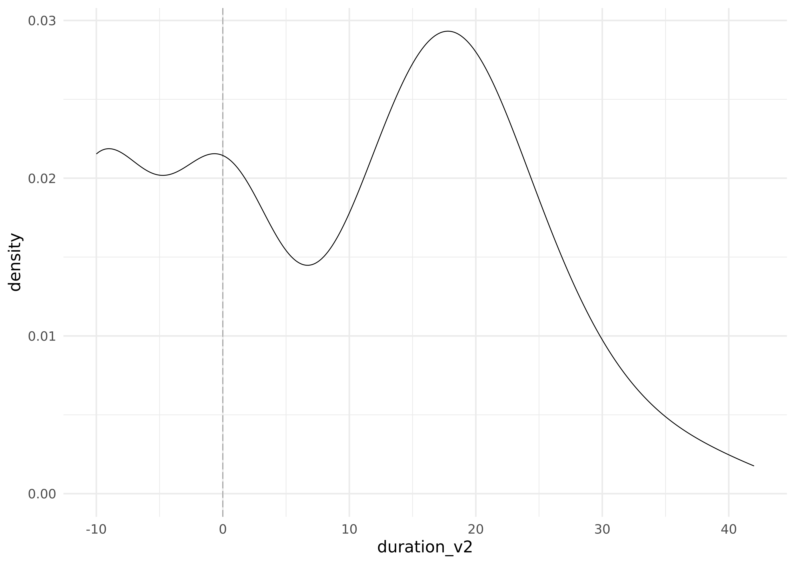
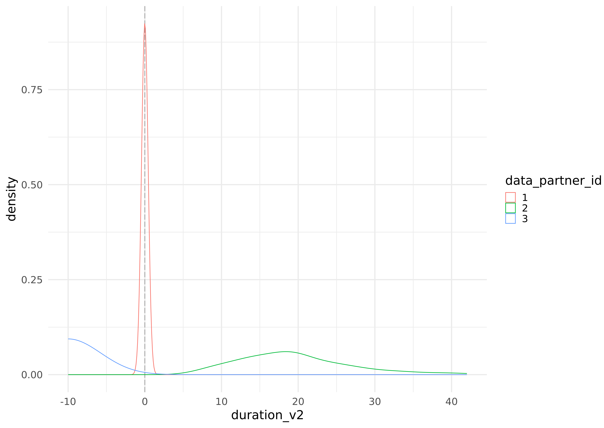
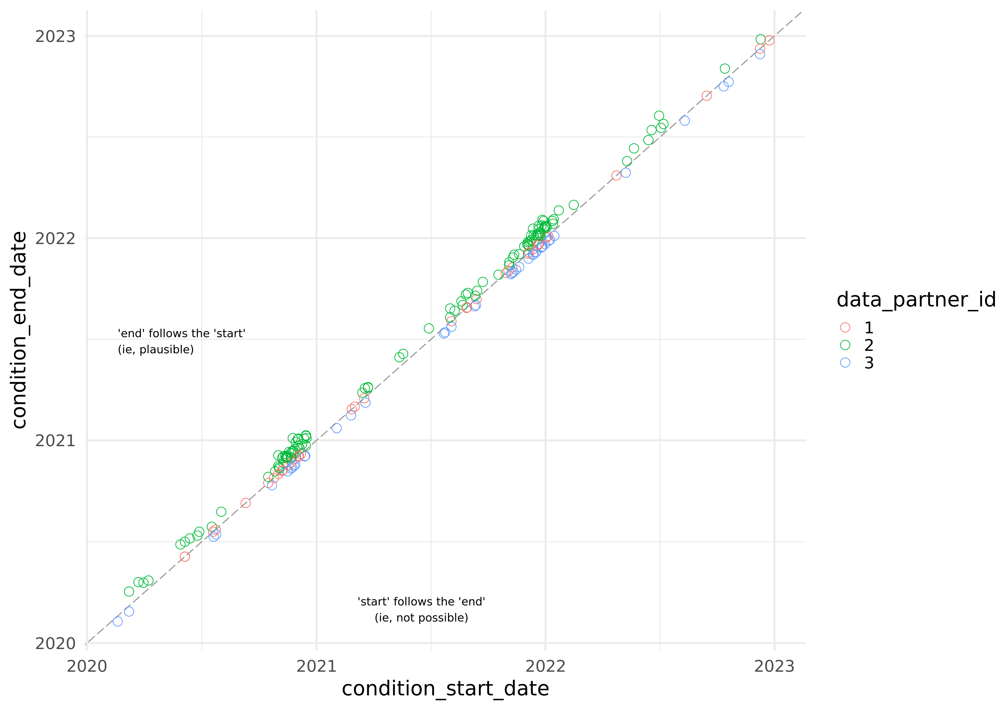

Data Validation with Synthetic Data
===============

This is part of the [Analysis with Synthetic Data](../) session.

## Expectations for the Validation Lesson

If the extraction lesson runs long, I'll breeze through this lesson to make up time.

I might ask you to watch my sequence, and replicate it in your own workbook.

## !! Real Analyses Must be Approved to Leave the Enclave !!

  

If you're following this document outside of class,
don't forget all analytical output (like tables, graphs, models, & screenshots)
*must be approved* before it's exported from the Enclave.
We'll discuss details later in Session 6.

Remember Session 3 uses only synthetic/fake data.
Therefore no patients can potentially be exposed by this handout.

But when you start working with real Level 2 or Level 3 data,
you must follow the procedures described in
[Session 6](https://github.com/National-COVID-Cohort-Collaborative/short-course-2024-january/tree/main/sessions/session-6#readme) and
the [Publishing and Sharing Your Work](https://national-covid-cohort-collaborative.github.io/guide-to-n3c-v1/chapters/publishing.html) chapter of [*G2N3C*](https://national-covid-cohort-collaborative.github.io/guide-to-n3c-v1/).

  

## Select Input Datasets

1.  Click the blue "Import dataset" button.
1.  Go to the directory for this class's L0 DUR: "All \> All projects \>
    N3C Training Area \> Group Exercises \> Introduction to Real World
    Data Analysis for COVID-19 Research, Spring 2024"
1.  Go to the directory that has the simulated for today's session:
    "analysis-with-synthetic-data"
1.  Select `condition_occurrence`, and click the blue "Select" button.
1.
Notes:

1.  The simulated `condition_occurrence` table mimics OMOP's
    [`condition_occurrence`](https://ohdsi.github.io/CommonDataModel/cdm60.html#CONDITION_OCCURRENCE) table.


## Global Code

1.  The [Global
    Code](https://www.palantir.com/docs/foundry/code-workbook/workbooks-global-code/)
    (in a right-hand panel), lets us define variables and functions that
    are available in all code transforms *in the workbook* (not the
    workspace). In today's "manipulation-1" workbook, we'll define
    constants and define helper functions.

1.  Global Code is essentially copy and pasted before each R transform
    is executed.

1.  We recommend that Global Code *defines* functions, but does not
    *call/execute* functions. In other words, define functions that R
    transforms can later execute.

1.  Paste following into the R tab of the Global Code panel.

    ``` r
    load_packages <- function () {
      # Load all fxs within these packages
      # library(magrittr) # If R <4.1
      # Throw an error if one of these packages are missing
      requireNamespace("arrow")
      requireNamespace("dplyr")
      requireNamespace("tidyr")
    }

    # ---- Code Specific to this Workbook -----------
    retrieve_condition_occurrence <- function(node) {
      condition_occurrence |>
        SparkR::arrange("condition_occurrence_id") |>
        SparkR::mutate(
          # Version 1: calculate it in the Spark world
          # https://spark.apache.org/docs/2.0.2/api/R/datediff.html
          duration_v1 =
            datediff(
              condition_occurrence$condition_end_date,
              condition_occurrence$condition_start_date
            )
        ) |>
        SparkR::collect() |> # Cross from the Spark world into the R world
        tibble::as_tibble() |>
        dplyr::mutate(
          data_partner_id = factor(data_partner_id),

          # Version 2: calculate it in the R world.
          #   https://stat.ethz.ch/R-manual/R-devel/library/base/html/difftime.html
          duration_v2 =
            as.integer(difftime(
              condition_start_date,
              condition_end_date,
              units = "day"
            ))
        )
    }

    # ---- Asserts -----------
    # These functions try to return helpful error messages for misspecifications
    assert_r_data_frame <- function(x) {
      if (!inherits(x, "data.frame")) {
        stop("The dataset is not an 'R data.frame`; convert it.")
      }
    }
    assert_spark_data_frame <- function(x) {
      if (!inherits(x, "SparkDataFrame")) {
        stop("The dataset is not a 'SparkDataFrame`; convert it.")
      }
    }
    assert_transform_object <- function(x) {
      if (!inherits(x, "FoundryTransformInput")) {
        stop("The dataset is not a 'FoundryTransformInput`; convert it.")
      }
    }

    # ---- IO --------------
    # Convert between R data.frames and parquet files.
    to_parquet <- function(d, assert_data_frame = TRUE) {
      if (assert_data_frame) assert_r_data_frame(d)
      output    <- new.output()
      output_fs <- output$fileSystem()
      arrow::write_parquet(
        x    = d,
        sink = output_fs$get_path("parquet", 'w')
      )

      stat <-
        sprintf(
          "%i_cols-by-%.1f_krows",
          ncol(d),
          nrow(d) / 1000
        )
      # Write a dummy dataset with a meaningful file name.
      write.csv(mtcars, output_fs$get_path(stat, 'w'))
    }
    from_parquet <- function(node) {
      fs   <- node$fileSystem()
      path <- fs$get_path("parquet", 'r')
      arrow::read_parquet(path)
    }
    ```

## Create R Transform: `g_duration`

1.  Click the `condition_occurrence` transform, then click the blue plus button, then select "R code".
1.  Change the new transform's name from "unnamed" to `g_duration`.
1.  Caution: keep the name *very* unique.
1.  Verify that you have one input: `condition_occurrence`. The color is orange.
1.  Verify its type is "Spark" in both places.
1.  Replace the code in the " Logic" panel with

    ```r
    g_duration_by_partner <- function(condition_occurrence) {
      load_packages()
      assert_spark_data_frame(condition_occurrence)
      
      # Define which data_partners you want to isolate 
      #   (remember there are 70+ in the real dataset)
      partners_to_inspect <- c(1, 2, 3)
      
      # ---- retrieve -----------------
      # Defined in the Global Code
      ds <- retrieve_condition_occurrence(condition_occurrence)
      
      # ---- tweak -----------------
      ds <-
        ds |>
        dplyr::filter(data_partner_id %in% partners_to_inspect)
      
      # ---- graph -----------------
      g <- 
        ds |>
        ggplot(aes(x = duration_v2, color = data_partner_id)) + # The big change from the previous transform
        geom_vline(xintercept = 0, color = "gray60", linetype = "83") +
        geom_density() +
        theme_minimal(base_size = 20)
      
      print(g)
      
      # Return top 100 rows for just previewing
      ds |>
        dplyr::slice(1:100)
    }
    ```

1.  Click the blue "Run" (or "Preview" button)
1.  Hover over the transform; click the " View image" button.
1.  Verify graph looks like:

    <a href="images/g-duration.png"></a>

## Create R Transform: `g_duration_by_partner`

1.  Click the `condition_occurrence` transform, then click the blue plus button, then select "R code".
1.  Change the new transform's name from "unnamed" to `g_duration_by_partner`.
1.  Toggle the "Save as dataset" on.
1.  A 2nd name pops up for the transform.
    Keep the pair of names consistent (eg, `g_duration_by_partner` also).
1.  Caution: keep the name *very* unique.
1.  Verify that you have one input: `condition_occurrence`. The color is orange.
1.  Verify its type is "Spark" in both places.
1.  Replace the code in the " Logic" panel with

    ```r
    g_duration_by_partner <- function(condition_occurrence) {
      load_packages()
      assert_spark_data_frame(condition_occurrence)

      # Define which data_partners you want to isolate
      #   (remember there are 70+ in the real dataset)
      partners_to_inspect <- c(1, 2, 3)

      # ---- retrieve -----------------
      # Defined in the Global Code
      ds <- retrieve_condition_occurrence(condition_occurrence)

      # ---- tweak -----------------
      ds <-
        ds |>
        dplyr::filter(data_partner_id %in% partners_to_inspect)

      # ---- graph -----------------
      g <-
        ds |>
        ggplot(aes(x = duration_v2, color = data_partner_id)) +
        geom_vline(xintercept = 0, color = "gray60", linetype = "83") +
        geom_density() +
        theme_minimal(base_size = 20)

      print(g)

      # Return top 100 rows for just previewing
      ds |>
        dplyr::slice(1:100)
    }
    ```

1.  Click the blue "Run" (or "Preview" button)
1.  Hover over the transform; click the " View image" button.
1.  Verify graph looks like:

    <a href="images/g-duration-by-partner.png"></a>

## Create R Transform: `g_start_end_by_partner`

1.  Click the `condition_occurrence` transform, then click the blue plus button, then select "R code".
1.  Change the new transform's name from "unnamed" to `g_start_end_by_partner`.
1.  Toggle the "Save as dataset" on.
1.  A 2nd name pops up for the transform.
    Keep the pair of names consistent (eg, `g_start_end_by_partner` also).
1.  Caution: keep the name *very* unique.
1.  Verify that you have one input: `condition_occurrence`. The color is orange.
1.  Verify its type is "Spark" in both places.
1.  Replace the code in the " Logic" panel with

    ```r
    g_start_end_by_partner <- function(condition_occurrence) {
      load_packages()
      assert_spark_data_frame(condition_occurrence)

      # ---- retrieve -----------------
      # Defined in the Global Code
      ds <- retrieve_condition_occurrence(condition_occurrence)

      # ---- graph -----------------
      g <-
        ds |>
        ggplot(aes(x = condition_start_date, y = condition_end_date, color = data_partner_id)) +
        annotate( # Add a label at the left-center to orient reader faster
          "text",
          x     = min(ds$condition_start_date, na.rm = TRUE),
          y     = mean(ds$condition_end_date , na.rm = TRUE),
          label = "'end' follows the 'start'\n(ie, plausible)",
          hjust = 0
        ) +
        annotate( # Add a label at the center-bottom to orient reader faster
          "text",
          x     = mean(ds$condition_start_date, na.rm = TRUE),
          y     = min(ds$condition_end_date , na.rm = TRUE),
          label = "'start' follows the 'end'\n(ie, not possible)",
          vjust = 0
        ) +
        geom_abline(color = "gray60", linetype = "83") +
        geom_point(
          shape   = 21,
          size    = 4
        ) +
        theme_minimal(base_size = 20)

      print(g)

      # Return top 100 rows for just previewing
      ds |>
        dplyr::slice(1:100)
    }
    ```

1.  Click the blue "Run" (or "Preview" button)
1.  Hover over the transform; click the " View image" button.
1.  Verify graph looks like:

    <a href="images/g-start-end-by-partner.png"></a>

## Transforms within `validation-1`

If you followed this document, your workbook will resemble this image.

[](images/validation-1.png)
