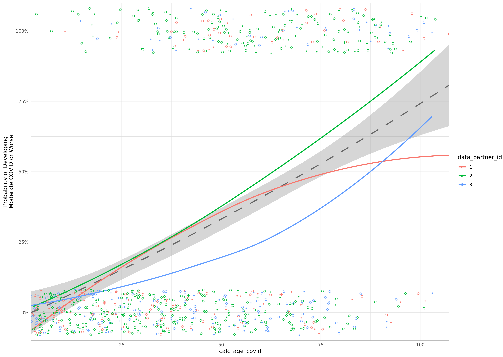
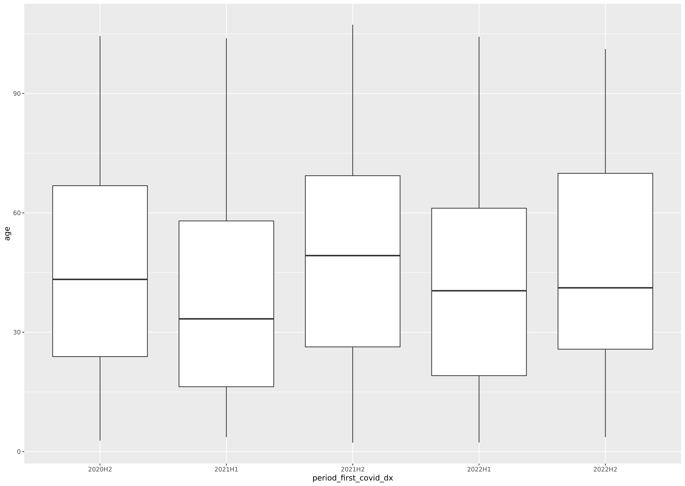
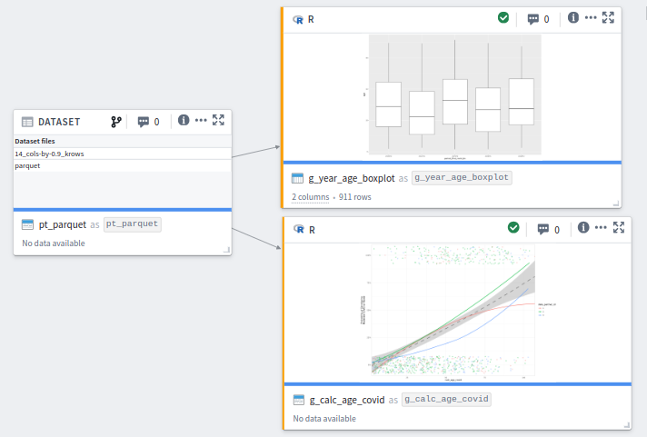

Data Visualization with Synthetic Data
==================

This is part of the [Analysis with Synthetic Data](../) session.

## Expectations for the Visualization Lesson

* We're assuming that you already know how to graph in your preferred language of R or Python.
* Here are the important adaptations you'll need to make when graphing in the Enclave
  (instead of something like RStudio).

## !! Real Analyses Must be Approved to Leave the Enclave !!

  

If you're following this document outside of class,
don't forget all analytical output (like tables, graphs, & models)
*must be approved* before it's exported from the Enclave.
We'll discuss details later in Session 6.

Remember Session 3 uses only synthetic/fake data.
Therefore no patients can potentially be exposed by this handout.

But when you start working with real Level 2 or Level 3 data,
you must follow the procedures described in
[Session 6](https://github.com/National-COVID-Cohort-Collaborative/short-course-2024-january/tree/main/sessions/session-6#readme) and
the [Publishing and Sharing Your Work](https://national-covid-cohort-collaborative.github.io/guide-to-n3c-v1/chapters/publishing.html) chapter of [*G2N3C*](https://national-covid-cohort-collaborative.github.io/guide-to-n3c-v1/).

  

## Open the "graphs-1" Code Workbook in the Foundry

That you created already in the [assignments leading into Session 3](../homework#create-the-graphs-1-code-workbook).

## Select `pt_parquet` as Input Dataset

1.  Click the blue "Import dataset" button.
1.  Go to the directory for this class's L0 DUR: "All \> All projects \>
    N3C Training Area \> Group Exercises \> Introduction to Real World
    Data Analysis for COVID-19 Research, Spring 2024"
1.  Go to the "Users" directory.
1.  Go to your personal directory.
1.  Go to "workbook-output/manipulation-1/" directory.
1.  Select `pt_parquet`.

## Global Code

1.  See the Global Code explanation in the
    [data extraction](../extraction#readme) part of today's session.

1.  Paste following into the R tab of the Global Code panel.

    ``` r
    load_packages <- function () {
      # Load all fxs within these packages
      library(ggplot2)
      # library(magrittr) # If R <4.1
      # Throw an error if one of these packages are missing
      requireNamespace("arrow")
      requireNamespace("dplyr")
      requireNamespace("tidyr")
    }

    # ---- Asserts -----------
    # These functions try to return helpful error messages for misspecifications
    assert_r_data_frame <- function(x) {
      if (!inherits(x, "data.frame")) {
        stop("The dataset is not an 'R data.frame`; convert it.")
      }
    }
    assert_spark_data_frame <- function(x) {
      if (!inherits(x, "SparkDataFrame")) {
        stop("The dataset is not a 'SparkDataFrame`; convert it.")
      }
    }
    assert_transform_object <- function(x) {
      if (!inherits(x, "FoundryTransformInput")) {
        stop("The dataset is not a 'FoundryTransformInput`; convert it.")
      }
    }

    # ---- IO --------------
    # Convert between R data.frames and parquet files.
    to_parquet <- function(d, assert_data_frame = TRUE) {
      if (assert_data_frame) assert_r_data_frame(d)
      output    <- new.output()
      output_fs <- output$fileSystem()
      arrow::write_parquet(
        x    = d,
        sink = output_fs$get_path("parquet", 'w')
      )

      stat <-
        sprintf(
          "%i_cols-by-%.1f_krows",
          ncol(d),
          nrow(d) / 1000
        )
      # Write a dummy dataset with a meaningful file name.
      write.csv(mtcars, output_fs$get_path(stat, 'w'))
    }
    from_parquet <- function(node) {
      fs   <- node$fileSystem()
      path <- fs$get_path("parquet", 'r')
      arrow::read_parquet(path)
    }
    ```

## Create R Transform: `g_calc_age_covid`

1.  Click the `pt_parquet` transform, then click the blue plus button, then select "R code".
1.  Click the gray plus button (above the code), and click the observation transform.
1.  Change the new transform's name from "unnamed" to `g_calc_age_covid`.
1.  Toggle the "Save as dataset" on.
1.  A 2nd name pops up for the transform.
    Keep the pair of names consistent (eg, `g_calc_age_covid` also).
1.  Caution: keep the name *very* unique.
    If it's the same name as a dataset or even a variable,
    you'll get frustratingly unhelpful or non-existent error messages.
    (For example, "Input or upstream dataset must be built before being used in the console: {tableName=calc_age_covid}").
1.  Verify that you have one input: `pt_parquet`. The color is orange.
1.  Verify its type is "Transform input" in both places.
1.  Replace the code in the " Logic" panel with

    ```r
    g_calc_age_covid <- function(pt_parquet) {
      load_packages()
      assert_transform_object(pt_parquet)

      ds <-
        pt_parquet |>
        from_parquet()     # Defined in Global Code

      g1 <-
        ds |>
        ggplot(aes(x = calc_age_covid, y = covid_moderate_plus)) +
        geom_point()

      print(g1)
      return(NULL) # The transform needs to return a dataset (even if it's a null dataset)
    }
    ```

## Improve `g_calc_age_covid`

1.  Replace the code in the " Logic" panel with

    ```r
    g_calc_age_covid <- function(pt_parquet) {
      load_packages()
      assert_transform_object(pt_parquet)

      ds <-
        pt_parquet |>
        from_parquet()     # Defined in Global Code

      g1 <-
        ds |>
        ggplot(aes(
          x = calc_age_covid,
          y = covid_moderate_plus,
          group = data_partner_id,
          color = data_partner_id
          # fill = data_partner_id
        )) +
        geom_smooth(
          mapping = aes(group = NA, color = NULL, fill = NULL),
          method = "loess",
          span = 2,
          color = "gray40",
          linetype = "88",
          na.rm    = TRUE
        ) +
        geom_smooth(
          method = "loess",
          span = 2,
          se = FALSE,
          na.rm    = TRUE
        ) +
        geom_point(
          shape     = 1,
          position  = position_jitter(height = .08),
          na.rm     = TRUE
        ) +
        scale_y_continuous(labels = scales::label_percent()) +
        # scale_y_continuous(labels = scales::percent_format()) +
        coord_cartesian(ylim = c(-.1, 1.1), expand = F) +
        theme_light() +
        theme(axis.ticks = element_blank()) +
        labs(
          y = "Probability of Developing\nModerate COVID or Worse"
        )

      print(g1)
      return(NULL) # The transform needs to return a dataset (even if it's a null dataset)
    }
    ```

1.  Click the blue "Run" (or "Preview" button)
1.  Hover over the transform; click the " View image" button.
1.  Verify graph looks like:

    <a href="images/g-calc-age-covid.png"></a>


## Create R Transform: `g_year_age_boxplot`

1.  Similar to the steps for `g_calc_age_covid`, but use the following code.
1.  Notice this returns a small dataset, instead of nothing.
    But whatever you do, please return something in the last line.
    The debugging process is very frustrating otherwise.

    ```r
    g_year_age_boxplot <- function(pt_parquet) {
      load_packages()
      assert_transform_object(pt_parquet)

      ds <-
        pt_parquet |>
        from_parquet() |>     # Defined in Global Code
        dplyr::select(
          age   = calc_age_covid,
          period_first_covid_dx,
        ) #|>
        # dplyr::mutate(
        # year_f  = factor(year)
        # )

      g <-
        ggplot(ds, aes(x = period_first_covid_dx, y = age)) +
        geom_boxplot()

      print(g)

      # Return something, preferably the dataset underneath the graph.
      #    Don't end with `print()`.
      return(ds)
    }
    ```

1.  Click the blue "Run" (or "Preview" button)
1.  Hover over the transform; click the " View image" button.
1.  Verify graph looks like:

    <a href="images/g-year-age-boxplot.png"></a>

## Transforms within `graphs-1`

If you followed this document, your workbook will resemble this image.

[](images/graphs-1.png)

## Resources

* [ggplot2 website](https://ggplot2.tidyverse.org/reference/)
* [*ggplot2: Elegant Graphics for Data Analysis*](https://www.amazon.com/ggplot2-Elegant-Graphics-Data-Analysis/dp/331924275X/) by Hadley Wickham
* [*R Graphics Cookbook, 2nd edition*](https://r-graphics.org/) by Winston Chang
* See [N3C resources](../../../background/assets.md) we've listed, especially
    * The [Languages Section](https://unite.nih.gov/workspace/documentation/product/code-workbook/languages) in the Palantir Foundry/Enclave documentation
    * [N3C Training](https://unite.nih.gov/workspace/slate/documents/training)
* An example of Python graphing code is referenced in the homework.
