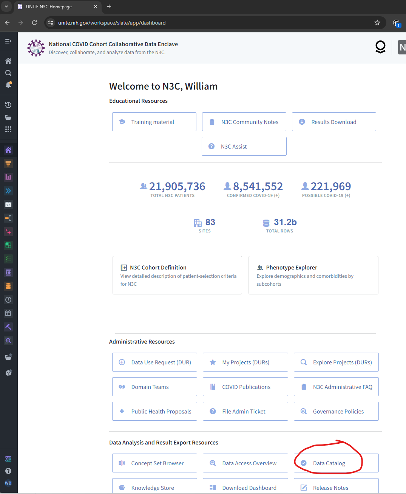
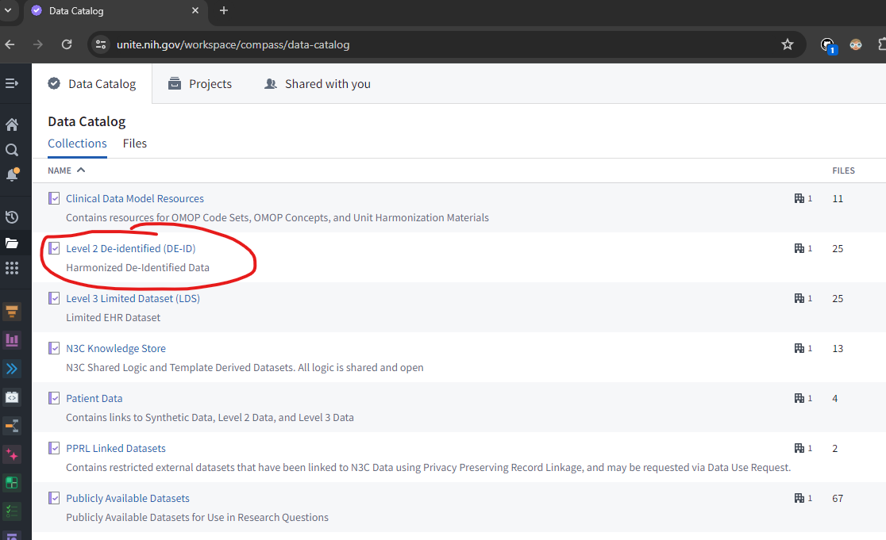
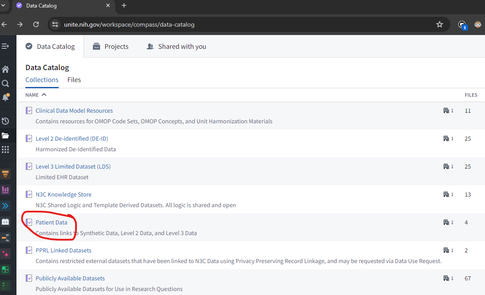
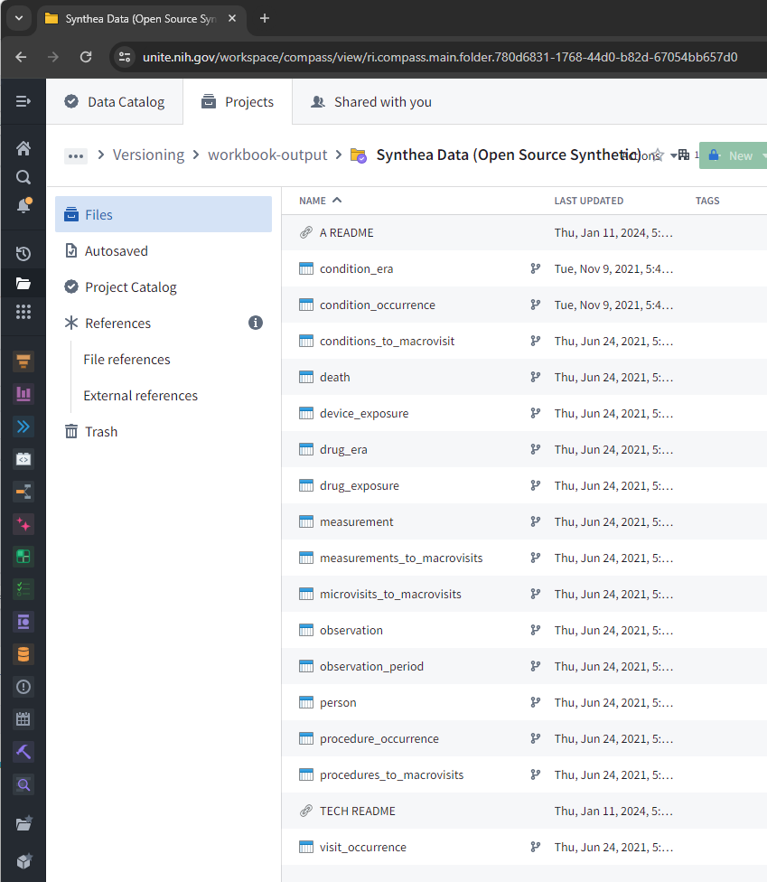
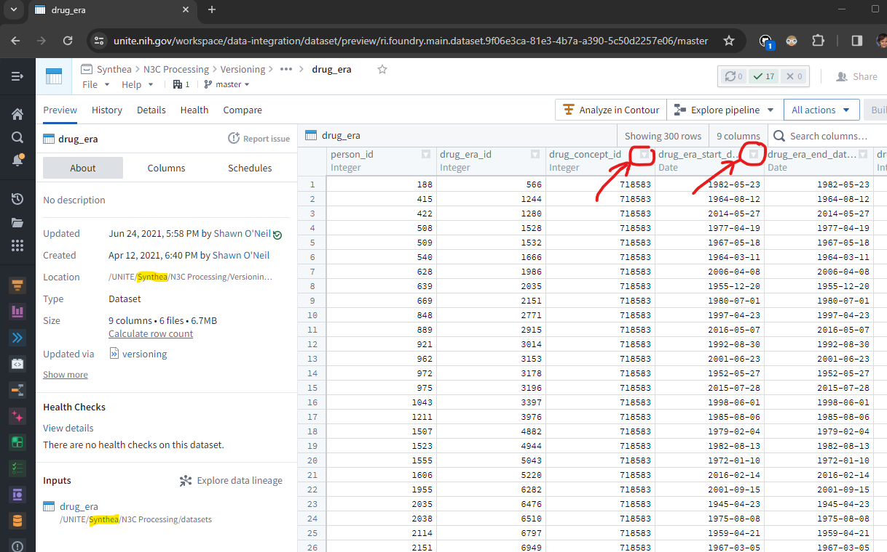

Building an Analytic Dataset Using Shared N3C Resources
============

Material
------------------------------
* Building an Analytic Dataset Using Shared N3C Resources ([pdf](building-an-analytic-dataset-using-n3c-tools.pdf) & [pptx](Building%20an%20Analytic%20Dataset%20Using%20N3C%20Tools.pptx))

Homework Before Session 4 Starts
------------------------------

1.  Go to Data Catalog from the [Main N3C Homepage](https://unite.nih.gov/workspace/slate/app/dashboard)

    

1.  Open Level 2 De-identified (DE-ID) folder _if you have access_,

    

    ..._otherwise_ go to Patient Data and open the Synthea Data folder.

    

1.  Familiarize yourself with the OMOP domain tables available.

    

1.  For several tables, open the dataset and review available column names
    (notice the pattern of source values vs concept id vs concept name).
    Add some filters on a couple columns and view stats on another column of interest
    as demonstrated by Andrea at the end of session 3.

    

Instructors who developed the curriculum and/or presented the material:
------------------------------

* [Johanna Loomba](https://github.com/JohannaLoomba) -- Slides (1st hour)
* [Andrea Zhou](https://github.com/agz5de) -- Demo (2nd hour)
