  This report covers the analyses used in the ZZZ project (Marcus Mark, PI).

<!--  Set the working directory to the repository's base directory; this assumes the report is nested inside of two directories.-->


<!-- Set the report-wide options, and point to the external code file. -->


<!-- Load 'sourced' R files.  Suppress the output when loading sources. -->


<!-- Load packages, or at least verify they're available on the local machine.  Suppress the output when loading packages. -->


<!-- Load any global functions and variables declared in the R file.  Suppress the output. -->


<!-- Declare any global functions specific to a Rmd output.  Suppress the output. -->


<!-- Load the datasets.   -->


<!-- Tweak the datasets.   -->


Summary {.tabset .tabset-fade .tabset-pills}
===========================================================================

Notes
---------------------------------------------------------------------------

1. The current report covers 91 patients, with 3 unique values for `data_partner_id`.


Unanswered Questions
---------------------------------------------------------------------------

Answered Questions
---------------------------------------------------------------------------


Univariate
===========================================================================

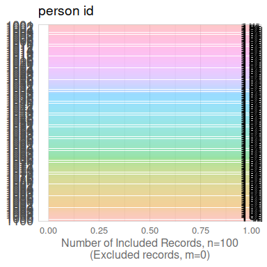<!-- -->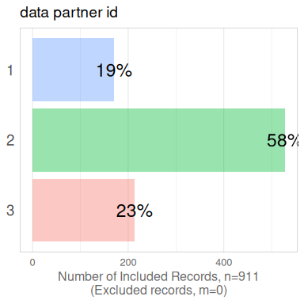<!-- -->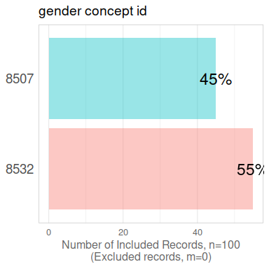<!-- -->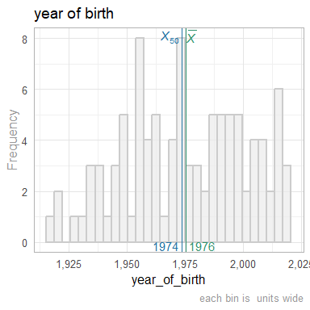<!-- -->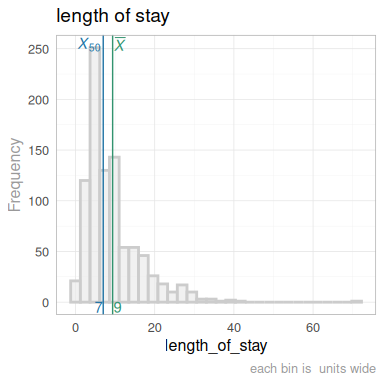<!-- -->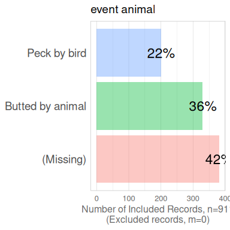<!-- -->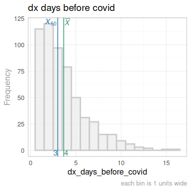<!-- -->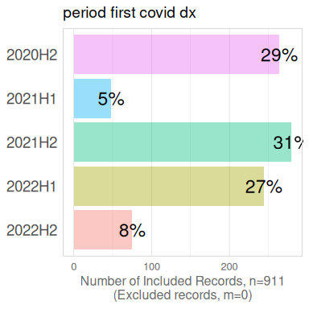<!-- -->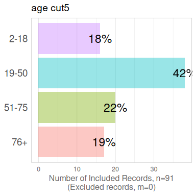<!-- -->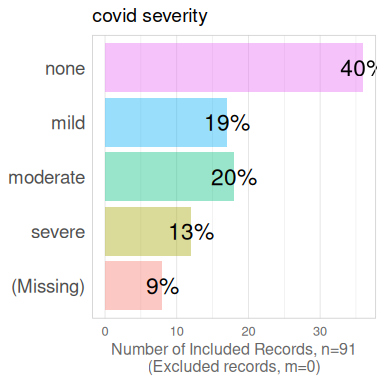<!-- --><!-- -->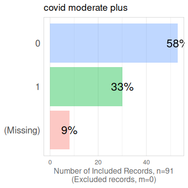<!-- -->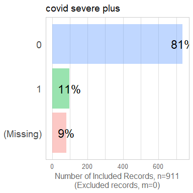<!-- -->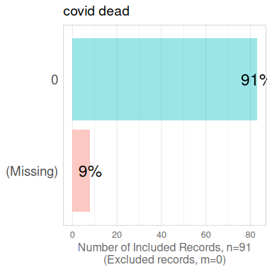<!-- -->


Multivariate
===========================================================================

latent risk 1
---------------------------------------------------------------------------


COVID Severity
---------------------------------------------------------------------------


Correlation Matrixes
---------------------------------------------------------------------------


Models
===========================================================================

latent risk 1
---------------------------------------------------------------------------

### latent risk 1 -exploration


### latent risk 1 -final


Session Information {#session-info}
===========================================================================

For the sake of documentation and reproducibility, the current report was rendered in the following environment.  Click the line below to expand.

  <details>
    <summary>Environment <span class="glyphicon glyphicon-plus-sign"></span></summary>
    
    ```
    ─ Session info ───────────────────────────────────────────────────────────────────────────────────
     setting  value
     version  R version 4.3.1 (2023-06-16)
     os       Ubuntu 23.10
     system   x86_64, linux-gnu
     ui       X11
     language (EN)
     collate  en_US.UTF-8
     ctype    en_US.UTF-8
     tz       America/Chicago
     date     2024-01-20
     pandoc   3.1.11 @ /usr/bin/ (via rmarkdown)
    
    ─ Packages ───────────────────────────────────────────────────────────────────────────────────────
     package         * version  date (UTC) lib source
     arrow             14.0.0.2 2023-12-02 [1] CRAN (R 4.3.1)
     assertthat        0.2.1    2019-03-21 [1] CRAN (R 4.3.1)
     base            * 4.3.1    2023-08-02 [4] local
     bit               4.0.5    2022-11-15 [1] CRAN (R 4.3.1)
     bit64             4.0.5    2020-08-30 [1] CRAN (R 4.3.1)
     bslib             0.6.1    2023-11-28 [1] CRAN (R 4.3.1)
     cachem            1.0.8    2023-05-01 [1] CRAN (R 4.3.1)
     cli               3.6.2    2023-12-11 [1] CRAN (R 4.3.1)
     colorspace        2.1-0    2023-01-23 [1] CRAN (R 4.3.1)
     compiler          4.3.1    2023-08-02 [4] local
     config            0.3.2    2023-08-30 [1] CRAN (R 4.3.1)
     corrplot          0.92     2021-11-18 [1] CRAN (R 4.3.1)
     datasets        * 4.3.1    2023-08-02 [4] local
     digest            0.6.34   2024-01-11 [1] CRAN (R 4.3.1)
     dplyr             1.1.4    2023-11-17 [1] CRAN (R 4.3.1)
     evaluate          0.23     2023-11-01 [1] CRAN (R 4.3.1)
     fansi             1.0.6    2023-12-08 [1] CRAN (R 4.3.1)
     farver            2.1.1    2022-07-06 [1] CRAN (R 4.3.1)
     fastmap           1.1.1    2023-02-24 [1] CRAN (R 4.3.1)
     forcats           1.0.0    2023-01-29 [1] CRAN (R 4.3.1)
     generics          0.1.3    2022-07-05 [1] CRAN (R 4.3.1)
     ggplot2         * 3.4.4    2023-10-12 [1] CRAN (R 4.3.1)
     glue              1.7.0    2024-01-09 [1] CRAN (R 4.3.1)
     graphics        * 4.3.1    2023-08-02 [4] local
     grDevices       * 4.3.1    2023-08-02 [4] local
     grid              4.3.1    2023-08-02 [4] local
     gtable            0.3.4    2023-08-21 [1] CRAN (R 4.3.1)
     highr             0.10     2022-12-22 [1] CRAN (R 4.3.1)
     htmltools         0.5.7    2023-11-03 [1] CRAN (R 4.3.1)
     jquerylib         0.1.4    2021-04-26 [1] CRAN (R 4.3.1)
     jsonlite          1.8.8    2023-12-04 [1] CRAN (R 4.3.1)
     knitr           * 1.45     2023-10-30 [1] CRAN (R 4.3.1)
     labeling          0.4.3    2023-08-29 [1] CRAN (R 4.3.1)
     lifecycle         1.0.4    2023-11-07 [1] CRAN (R 4.3.1)
     magrittr          2.0.3    2022-03-30 [1] CRAN (R 4.3.1)
     methods         * 4.3.1    2023-08-02 [4] local
     munsell           0.5.0    2018-06-12 [1] CRAN (R 4.3.1)
     pillar            1.9.0    2023-03-22 [1] CRAN (R 4.3.1)
     pkgconfig         2.0.3    2019-09-22 [1] CRAN (R 4.3.1)
     purrr             1.0.2    2023-08-10 [1] CRAN (R 4.3.1)
     R6                2.5.1    2021-08-19 [1] CRAN (R 4.3.1)
     rlang             1.1.3    2024-01-10 [1] CRAN (R 4.3.1)
     rmarkdown         2.25     2023-09-18 [1] CRAN (R 4.3.1)
     rstudioapi        0.15.0   2023-07-07 [1] CRAN (R 4.3.1)
     sass              0.4.8    2023-12-06 [1] CRAN (R 4.3.1)
     scales            1.3.0    2023-11-28 [1] CRAN (R 4.3.1)
     sessioninfo       1.2.2    2021-12-06 [1] CRAN (R 4.3.1)
     stats           * 4.3.1    2023-08-02 [4] local
     TabularManifest   0.2.1    2023-11-15 [1] Github (Melinae/TabularManifest@bcb12f7)
     tibble            3.2.1    2023-03-20 [1] CRAN (R 4.3.1)
     tidyselect        1.2.0    2022-10-10 [1] CRAN (R 4.3.1)
     tools             4.3.1    2023-08-02 [4] local
     utf8              1.2.4    2023-10-22 [1] CRAN (R 4.3.1)
     utils           * 4.3.1    2023-08-02 [4] local
     vctrs             0.6.5    2023-12-01 [1] CRAN (R 4.3.1)
     withr             3.0.0    2024-01-16 [1] CRAN (R 4.3.1)
     xfun              0.41     2023-11-01 [1] CRAN (R 4.3.1)
     yaml              2.3.8    2023-12-11 [1] CRAN (R 4.3.1)
    
     [1] /home/wibeasley/R/x86_64-pc-linux-gnu-library/4.3
     [2] /usr/local/lib/R/site-library
     [3] /usr/lib/R/site-library
     [4] /usr/lib/R/library
    
    ──────────────────────────────────────────────────────────────────────────────────────────────────
    ```
  </details>


Report rendered by wibeasley at 2024-01-20, 13:32 -0600 in 4 seconds.
