  This report covers the analyses used in the ZZZ project (Marcus Mark, PI).

<!--  Set the working directory to the repository's base directory; this assumes the report is nested inside of two directories.-->


<!-- Set the report-wide options, and point to the external code file. -->


<!-- Load 'sourced' R files.  Suppress the output when loading sources. -->


<!-- Load packages, or at least verify they're available on the local machine.  Suppress the output when loading packages. -->


<!-- Load any global functions and variables declared in the R file.  Suppress the output. -->


<!-- Declare any global functions specific to a Rmd output.  Suppress the output. -->


<!-- Load the datasets.   -->


<!-- Tweak the datasets.   -->


Summary {.tabset .tabset-fade .tabset-pills}
===========================================================================

Notes
---------------------------------------------------------------------------

1. The current report covers 100 patients, with 3 unique values for `data_partner_id`.


Unanswered Questions
---------------------------------------------------------------------------

Answered Questions
---------------------------------------------------------------------------


Univariate
===========================================================================

`person` table
---------------------------------------------------------------------------

<!-- --><!-- --><!-- --><!-- --><!-- --><!-- --><!-- --><!-- -->

`patient` table
---------------------------------------------------------------------------

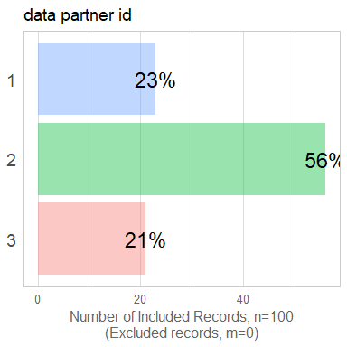<!-- -->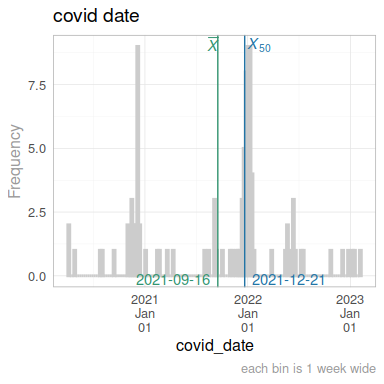<!-- -->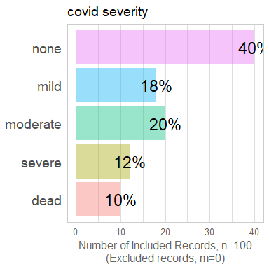<!-- -->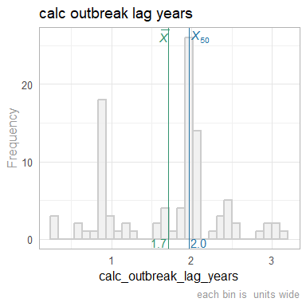<!-- -->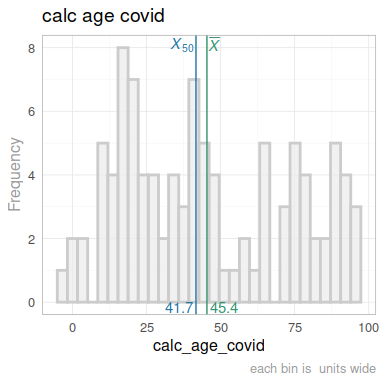<!-- -->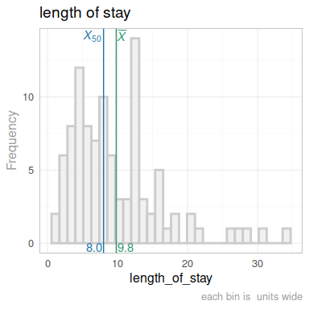<!-- -->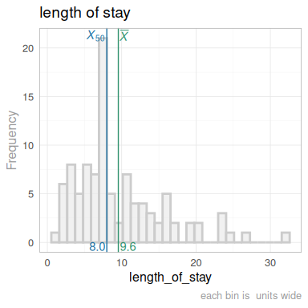<!-- -->

`patient_latent` table
---------------------------------------------------------------------------

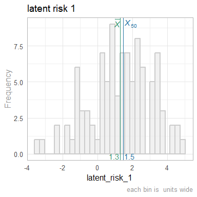<!-- -->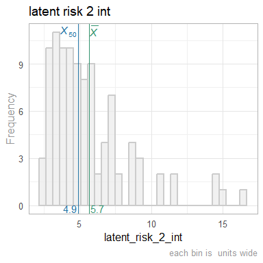<!-- --><!-- -->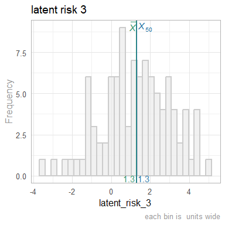<!-- -->

`site_latent` table
---------------------------------------------------------------------------

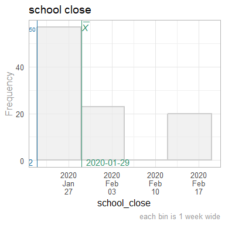<!-- -->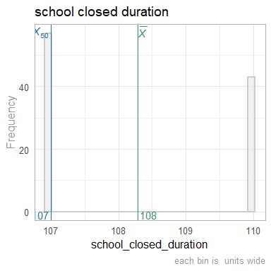<!-- -->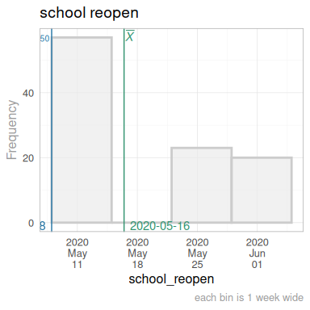<!-- -->


Multivariate
===========================================================================

latent risk 1
---------------------------------------------------------------------------

<!-- --><!-- -->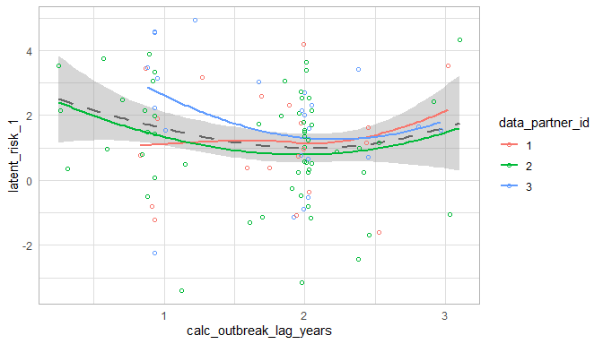<!-- -->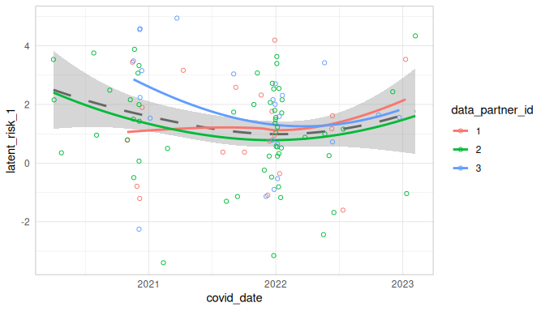<!-- -->

COVID Severity
---------------------------------------------------------------------------

<!-- -->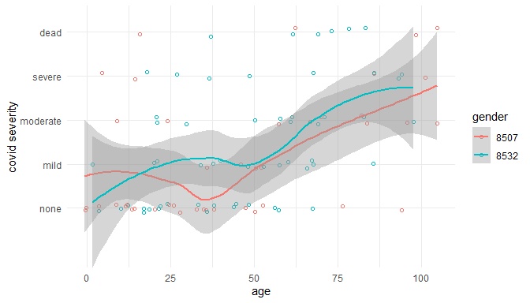<!-- --><!-- -->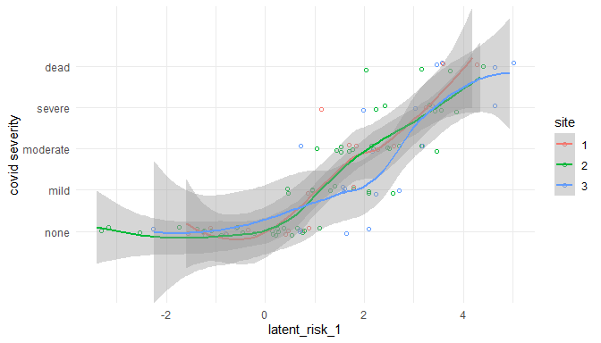<!-- -->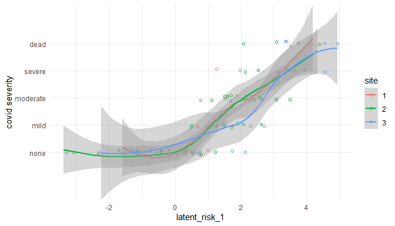<!-- -->

Correlation Matrixes
---------------------------------------------------------------------------

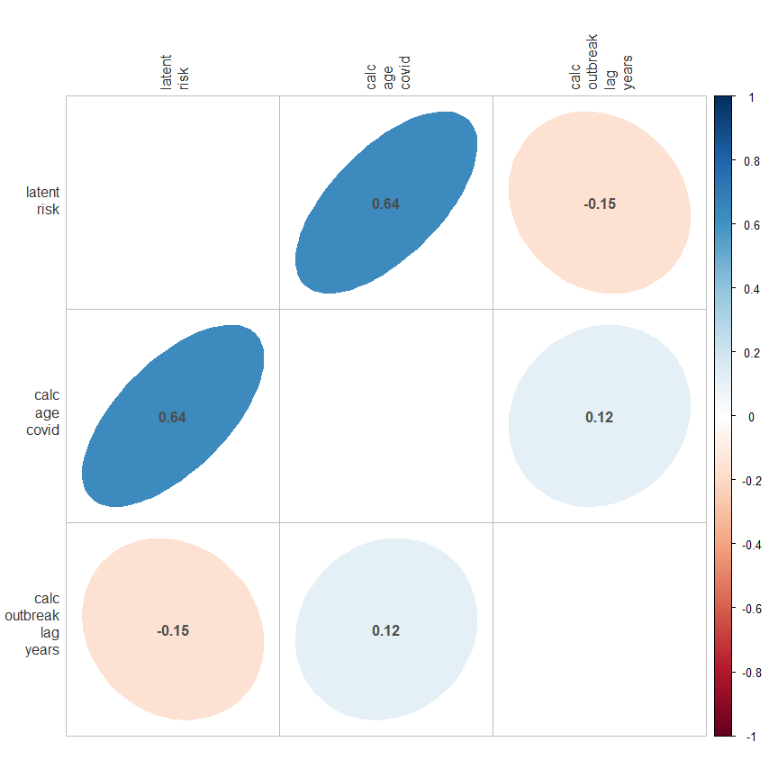<!-- -->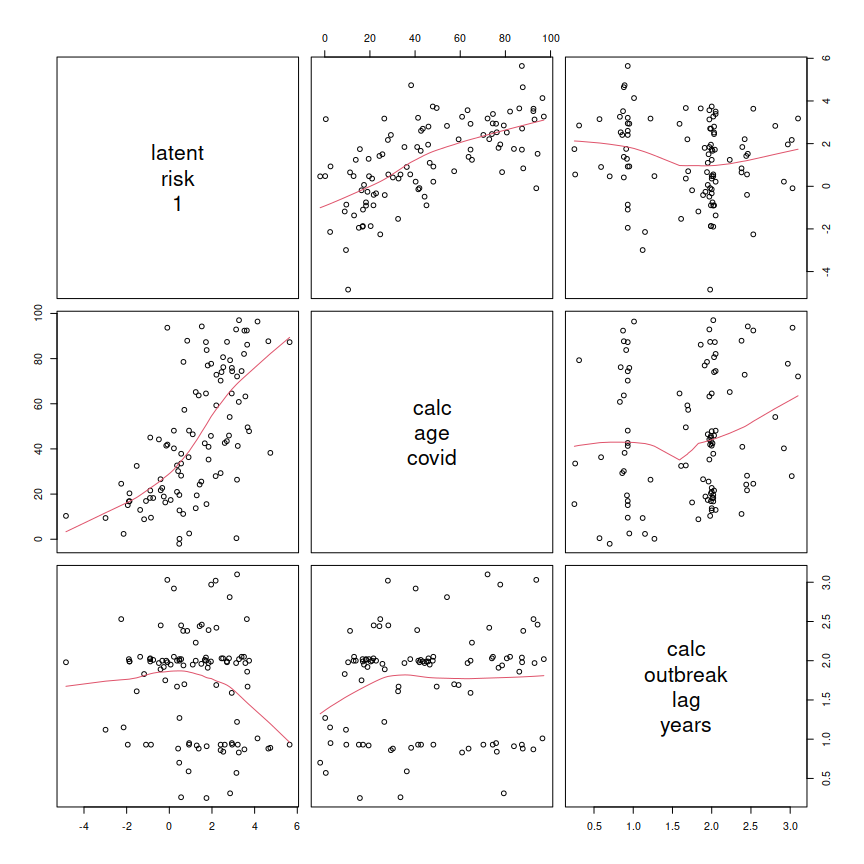<!-- -->

|                                 | latent<br>risk<br>1| calc<br>age<br>covid| calc<br>outbreak<br>lag<br>years|
|:--------------------------------|-------------------:|--------------------:|--------------------------------:|
|latent<br>risk<br>1              |               1.000|                0.579|                           -0.153|
|calc<br>age<br>covid             |               0.579|                1.000|                            0.115|
|calc<br>outbreak<br>lag<br>years |              -0.153|                0.115|                            1.000|


Models
===========================================================================

latent risk 1
---------------------------------------------------------------------------

### latent risk 1 -exploration


```
============= Simple model that's just an intercept. =============
```

```

Call:
lm(formula = latent_risk_1 ~ 1, data = ds_patient)

Residuals:
    Min      1Q  Median      3Q     Max 
-4.6882 -0.9865  0.1987  1.2047  3.6497 

Coefficients:
            Estimate Std. Error t value Pr(>|t|)
(Intercept)   1.2932     0.1769   7.311 6.94e-11

Residual standard error: 1.769 on 99 degrees of freedom
```

```
============= Model includes one predictor: `outbreak_lag`. =============
```

```

Call:
lm(formula = latent_risk_1 ~ 1 + calc_outbreak_lag_years, data = ds_patient)

Residuals:
    Min      1Q  Median      3Q     Max 
-4.9286 -0.9597  0.1932  1.2990  3.6090 

Coefficients:
                        Estimate Std. Error t value Pr(>|t|)
(Intercept)               1.9887     0.4871   4.083 9.09e-05
calc_outbreak_lag_years  -0.4064     0.2655  -1.531    0.129

Residual standard error: 1.757 on 98 degrees of freedom
Multiple R-squared:  0.02335,	Adjusted R-squared:  0.01339 
F-statistic: 2.343 on 1 and 98 DF,  p-value: 0.129
```

```
============= Model includes one predictor: `calc_age_covid`. =============
```

```

Call:
lm(formula = latent_risk_1 ~ 1 + calc_age_covid, data = ds_patient)

Residuals:
    Min      1Q  Median      3Q     Max 
-4.5738 -0.8105 -0.0186  0.9764  3.7543 

Coefficients:
                Estimate Std. Error t value Pr(>|t|)
(Intercept)    -0.387711   0.279607  -1.387    0.169
calc_age_covid  0.036155   0.005143   7.030 2.78e-10

Residual standard error: 1.449 on 98 degrees of freedom
Multiple R-squared:  0.3353,	Adjusted R-squared:  0.3285 
F-statistic: 49.43 on 1 and 98 DF,  p-value: 2.782e-10
```

```
============= Model includes two predictors. =============
```

```

Call:
lm(formula = latent_risk_1 ~ 1 + calc_outbreak_lag_years + calc_age_covid, 
    data = ds_patient)

Residuals:
    Min      1Q  Median      3Q     Max 
-4.4210 -0.8781  0.0072  1.0068  3.3205 

Coefficients:
                         Estimate Std. Error t value Pr(>|t|)
(Intercept)              0.549032   0.433284   1.267  0.20814
calc_outbreak_lag_years -0.590468   0.213323  -2.768  0.00676
calc_age_covid           0.037743   0.005009   7.535 2.58e-11

Residual standard error: 1.403 on 97 degrees of freedom
Multiple R-squared:  0.3839,	Adjusted R-squared:  0.3712 
F-statistic: 30.22 on 2 and 97 DF,  p-value: 6.273e-11
```

### latent risk 1 -final


|                        | Estimate| Std. Error| t value| Pr(>&#124;t&#124;)|
|:-----------------------|--------:|----------:|-------:|------------------:|
|(Intercept)             |     0.55|       0.43|    1.27|               0.21|
|calc_outbreak_lag_years |    -0.59|       0.21|   -2.77|               0.01|
|calc_age_covid          |     0.04|       0.01|    7.53|               0.00|


Session Information {#session-info}
===========================================================================

For the sake of documentation and reproducibility, the current report was rendered in the following environment.  Click the line below to expand.

  <details>
    <summary>Environment <span class="glyphicon glyphicon-plus-sign"></span></summary>
    
    ```
    ─ Session info ───────────────────────────────────────────────────────────────────────────────────
     setting  value
     version  R version 4.3.1 (2023-06-16)
     os       Ubuntu 23.10
     system   x86_64, linux-gnu
     ui       RStudio
     language (EN)
     collate  en_US.UTF-8
     ctype    en_US.UTF-8
     tz       America/Chicago
     date     2024-01-20
     rstudio  2023.12.0+369 Ocean Storm (desktop)
     pandoc   3.1.11 @ /usr/bin/ (via rmarkdown)
    
    ─ Packages ───────────────────────────────────────────────────────────────────────────────────────
     package         * version    date (UTC) lib source
     archive           1.1.7      2023-12-11 [1] CRAN (R 4.3.1)
     arrow             14.0.0.2   2023-12-02 [1] CRAN (R 4.3.1)
     assertthat        0.2.1      2019-03-21 [1] CRAN (R 4.3.1)
     backports         1.4.1      2021-12-13 [1] CRAN (R 4.3.1)
     base            * 4.3.1      2023-08-02 [4] local
     bit               4.0.5      2022-11-15 [1] CRAN (R 4.3.1)
     bit64             4.0.5      2020-08-30 [1] CRAN (R 4.3.1)
     blob              1.2.4      2023-03-17 [1] CRAN (R 4.3.1)
     bslib             0.6.1      2023-11-28 [1] CRAN (R 4.3.1)
     cachem            1.0.8      2023-05-01 [1] CRAN (R 4.3.1)
     checkmate         2.3.1      2023-12-04 [1] CRAN (R 4.3.1)
     chron             2.3-61     2023-05-02 [1] CRAN (R 4.3.1)
     cli               3.6.2      2023-12-11 [1] CRAN (R 4.3.1)
     colorspace        2.1-0      2023-01-23 [1] CRAN (R 4.3.1)
     compiler          4.3.1      2023-08-02 [4] local
     config            0.3.2      2023-08-30 [1] CRAN (R 4.3.1)
     corrplot          0.92       2021-11-18 [1] CRAN (R 4.3.1)
     crayon            1.5.2      2022-09-29 [1] CRAN (R 4.3.1)
     datasets        * 4.3.1      2023-08-02 [4] local
     DBI               1.2.1      2024-01-12 [1] CRAN (R 4.3.1)
     digest            0.6.34     2024-01-11 [1] CRAN (R 4.3.1)
     dplyr             1.1.4      2023-11-17 [1] CRAN (R 4.3.1)
     duckdb            0.9.2-1    2023-11-28 [1] CRAN (R 4.3.1)
     evaluate          0.23       2023-11-01 [1] CRAN (R 4.3.1)
     fansi             1.0.6      2023-12-08 [1] CRAN (R 4.3.1)
     farver            2.1.1      2022-07-06 [1] CRAN (R 4.3.1)
     fastmap           1.1.1      2023-02-24 [1] CRAN (R 4.3.1)
     forcats           1.0.0      2023-01-29 [1] CRAN (R 4.3.1)
     fs                1.6.3      2023-07-20 [1] CRAN (R 4.3.1)
     generics          0.1.3      2022-07-05 [1] CRAN (R 4.3.1)
     ggplot2         * 3.4.4      2023-10-12 [1] CRAN (R 4.3.1)
     glue              1.7.0      2024-01-09 [1] CRAN (R 4.3.1)
     graphics        * 4.3.1      2023-08-02 [4] local
     grDevices       * 4.3.1      2023-08-02 [4] local
     grid              4.3.1      2023-08-02 [4] local
     gsubfn            0.7        2018-03-16 [1] CRAN (R 4.3.1)
     gtable            0.3.4      2023-08-21 [1] CRAN (R 4.3.1)
     highr             0.10       2022-12-22 [1] CRAN (R 4.3.1)
     hms               1.1.3      2023-03-21 [1] CRAN (R 4.3.1)
     htmltools         0.5.7      2023-11-03 [1] CRAN (R 4.3.1)
     jquerylib         0.1.4      2021-04-26 [1] CRAN (R 4.3.1)
     jsonlite          1.8.8      2023-12-04 [1] CRAN (R 4.3.1)
     knitr           * 1.45       2023-10-30 [1] CRAN (R 4.3.1)
     labeling          0.4.3      2023-08-29 [1] CRAN (R 4.3.1)
     lattice           0.22-5     2023-10-24 [1] CRAN (R 4.3.1)
     lifecycle         1.0.4      2023-11-07 [1] CRAN (R 4.3.1)
     lubridate         1.9.3      2023-09-27 [1] CRAN (R 4.3.1)
     magrittr          2.0.3      2022-03-30 [1] CRAN (R 4.3.1)
     Matrix            1.6-5      2024-01-11 [1] CRAN (R 4.3.1)
     memoise           2.0.1      2021-11-26 [1] CRAN (R 4.3.1)
     methods         * 4.3.1      2023-08-02 [4] local
     mgcv              1.9-1      2023-12-21 [1] CRAN (R 4.3.1)
     munsell           0.5.0      2018-06-12 [1] CRAN (R 4.3.1)
     nlme              3.1-164    2023-11-27 [1] CRAN (R 4.3.1)
     OuhscMunge        0.2.0.9016 2024-01-14 [1] local
     parallel          4.3.1      2023-08-02 [4] local
     pillar            1.9.0      2023-03-22 [1] CRAN (R 4.3.1)
     pkgconfig         2.0.3      2019-09-22 [1] CRAN (R 4.3.1)
     png               0.1-8      2022-11-29 [1] CRAN (R 4.3.1)
     proto             1.0.0      2016-10-29 [1] CRAN (R 4.3.1)
     purrr             1.0.2      2023-08-10 [1] CRAN (R 4.3.1)
     R6                2.5.1      2021-08-19 [1] CRAN (R 4.3.1)
     Rcpp              1.0.12     2024-01-09 [1] CRAN (R 4.3.1)
     readr             2.1.5      2024-01-10 [1] CRAN (R 4.3.1)
     reticulate        1.34.0     2023-10-12 [1] CRAN (R 4.3.1)
     rlang             1.1.3      2024-01-10 [1] CRAN (R 4.3.1)
     rmarkdown         2.25       2023-09-18 [1] CRAN (R 4.3.1)
     RSQLite         * 2.3.4      2023-12-08 [1] CRAN (R 4.3.1)
     rstudioapi        0.15.0     2023-07-07 [1] CRAN (R 4.3.1)
     sass              0.4.8      2023-12-06 [1] CRAN (R 4.3.1)
     scales            1.3.0      2023-11-28 [1] CRAN (R 4.3.1)
     sessioninfo       1.2.2      2021-12-06 [1] CRAN (R 4.3.1)
     splines           4.3.1      2023-08-02 [4] local
     sqldf             0.4-11     2017-06-28 [1] CRAN (R 4.3.1)
     stats           * 4.3.1      2023-08-02 [4] local
     TabularManifest   0.2.1      2023-11-15 [1] Github (Melinae/TabularManifest@bcb12f7)
     tcltk             4.3.1      2023-08-02 [4] local
     testit            0.13.1     2024-01-13 [1] Github (yihui/testit@698afd4)
     tibble            3.2.1      2023-03-20 [1] CRAN (R 4.3.1)
     tidyr             1.3.0      2023-01-24 [1] CRAN (R 4.3.1)
     tidyselect        1.2.0      2022-10-10 [1] CRAN (R 4.3.1)
     timechange        0.3.0      2024-01-18 [1] CRAN (R 4.3.1)
     tools             4.3.1      2023-08-02 [4] local
     tzdb              0.4.0      2023-05-12 [1] CRAN (R 4.3.1)
     utf8              1.2.4      2023-10-22 [1] CRAN (R 4.3.1)
     utils           * 4.3.1      2023-08-02 [4] local
     vctrs             0.6.5      2023-12-01 [1] CRAN (R 4.3.1)
     vroom             1.6.5      2023-12-05 [1] CRAN (R 4.3.1)
     withr             3.0.0      2024-01-16 [1] CRAN (R 4.3.1)
     xfun              0.41       2023-11-01 [1] CRAN (R 4.3.1)
     yaml              2.3.8      2023-12-11 [1] CRAN (R 4.3.1)
    
     [1] /home/wibeasley/R/x86_64-pc-linux-gnu-library/4.3
     [2] /usr/local/lib/R/site-library
     [3] /usr/lib/R/site-library
     [4] /usr/lib/R/library
    
    ──────────────────────────────────────────────────────────────────────────────────────────────────
    ```
  </details>


Report rendered by wibeasley at 2024-01-20, 13:02 -0600 in 12 seconds.
