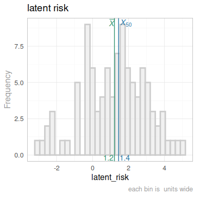
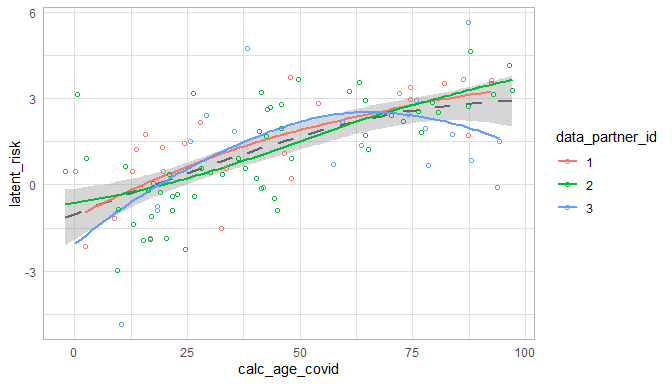
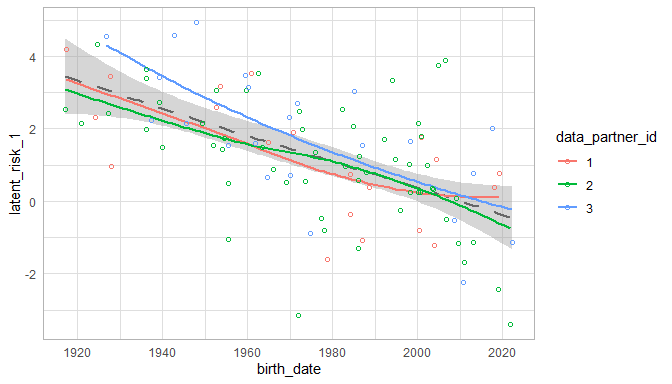
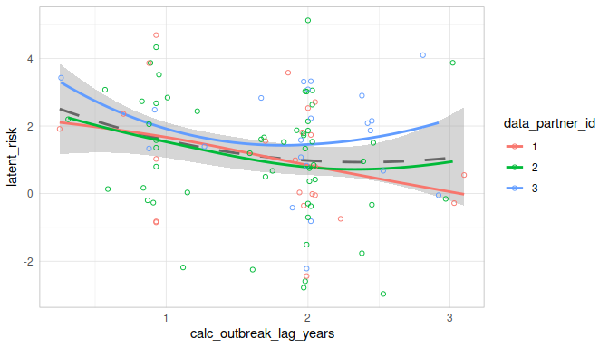
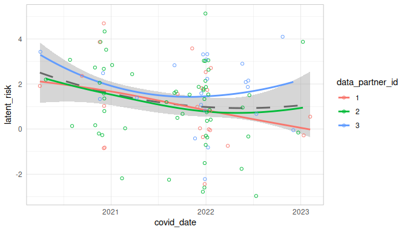

  This report covers the analyses used in the ZZZ project (Marcus Mark, PI).

<!--  Set the working directory to the repository's base directory; this assumes the report is nested inside of two directories.-->


<!-- Set the report-wide options, and point to the external code file. -->


<!-- Load 'sourced' R files.  Suppress the output when loading sources. -->


<!-- Load packages, or at least verify they're available on the local machine.  Suppress the output when loading packages. -->


<!-- Load any global functions and variables declared in the R file.  Suppress the output. -->


<!-- Declare any global functions specific to a Rmd output.  Suppress the output. -->


<!-- Load the datasets.   -->


<!-- Tweak the datasets.   -->


Summary {.tabset .tabset-fade .tabset-pills}
===========================================================================

Notes
---------------------------------------------------------------------------

1. The current report covers 100 patients, with 3 unique values for `data_partner_id`.


Unanswered Questions
---------------------------------------------------------------------------

Answered Questions
---------------------------------------------------------------------------


Univariate
===========================================================================

`person` table
---------------------------------------------------------------------------

<!-- --><!-- --><!-- --><!-- --><!-- --><!-- --><!-- --><!-- -->

`patient` table
---------------------------------------------------------------------------

<!-- --><!-- --><!-- --><!-- --><!-- -->

`patient_hidden` table
---------------------------------------------------------------------------

<!-- -->


Multivariate
===========================================================================

Scatterplots
---------------------------------------------------------------------------

<!-- --><!-- --><!-- --><!-- -->


Correlation Matrixes
---------------------------------------------------------------------------

<!-- --><!-- -->

|                                 | latent<br>risk| calc<br>age<br>covid| calc<br>outbreak<br>lag<br>years|
|:--------------------------------|--------------:|--------------------:|--------------------------------:|
|latent<br>risk                   |          1.000|                0.557|                           -0.193|
|calc<br>age<br>covid             |          0.557|                1.000|                            0.039|
|calc<br>outbreak<br>lag<br>years |         -0.193|                0.039|                            1.000|


Models
===========================================================================

Model Exploration
---------------------------------------------------------------------------

```
============= Simple model that's just an intercept. =============
```

```

Call:
lm(formula = latent_risk ~ 1, data = ds_person)

Residuals:
    Min      1Q  Median      3Q     Max 
-4.1903 -1.2430  0.2282  1.2710  3.9047 

Coefficients:
            Estimate Std. Error t value Pr(>|t|)
(Intercept)   1.2213     0.1762    6.93 4.33e-10

Residual standard error: 1.762 on 99 degrees of freedom
```

```
============= Model includes one predictor: `outbreak_lag`. =============
```

```

Call:
lm(formula = latent_risk ~ 1 + calc_outbreak_lag_years, data = ds_person)

Residuals:
    Min      1Q  Median      3Q     Max 
-3.8797 -1.0852  0.0575  1.1719  4.0449 

Coefficients:
                        Estimate Std. Error t value
(Intercept)               2.1190     0.4927   4.300
calc_outbreak_lag_years  -0.5190     0.2665  -1.947
                        Pr(>|t|)
(Intercept)             4.03e-05
calc_outbreak_lag_years   0.0544

Residual standard error: 1.738 on 98 degrees of freedom
Multiple R-squared:  0.03724,	Adjusted R-squared:  0.02742 
F-statistic: 3.791 on 1 and 98 DF,  p-value: 0.05439
```

```
============= Model includes one predictor: `calc_age_covid`. =============
```

```

Call:
lm(formula = latent_risk ~ 1 + calc_age_covid, data = ds_person)

Residuals:
    Min      1Q  Median      3Q     Max 
-4.4709 -0.9323  0.0003  0.9923  3.8083 

Coefficients:
               Estimate Std. Error t value Pr(>|t|)
(Intercept)    -0.44611    0.29124  -1.532    0.129
calc_age_covid  0.03629    0.00547   6.634  1.8e-09

Residual standard error: 1.471 on 98 degrees of freedom
Multiple R-squared:  0.3099,	Adjusted R-squared:  0.3029 
F-statistic: 44.01 on 1 and 98 DF,  p-value: 1.804e-09
```

```
============= Model includes two predictors. =============
```

```

Call:
lm(formula = latent_risk ~ 1 + calc_outbreak_lag_years + calc_age_covid, 
    data = ds_person)

Residuals:
    Min      1Q  Median      3Q     Max 
-4.3362 -0.8781  0.0878  0.9298  3.3405 

Coefficients:
                         Estimate Std. Error t value
(Intercept)              0.528257   0.465615   1.135
calc_outbreak_lag_years -0.577603   0.219275  -2.634
calc_age_covid           0.036831   0.005316   6.929
                        Pr(>|t|)
(Intercept)              0.25937
calc_outbreak_lag_years  0.00982
calc_age_covid          4.67e-10

Residual standard error: 1.429 on 97 degrees of freedom
Multiple R-squared:  0.356,	Adjusted R-squared:  0.3427 
F-statistic: 26.81 on 2 and 97 DF,  p-value: 5.385e-10
```


Final Model
---------------------------------------------------------------------------


|                        | Estimate| Std. Error| t value| Pr(>&#124;t&#124;)|
|:-----------------------|--------:|----------:|-------:|------------------:|
|(Intercept)             |     0.53|       0.47|    1.13|               0.26|
|calc_outbreak_lag_years |    -0.58|       0.22|   -2.63|               0.01|
|calc_age_covid          |     0.04|       0.01|    6.93|               0.00|


Session Information {#session-info}
===========================================================================

For the sake of documentation and reproducibility, the current report was rendered in the following environment.  Click the line below to expand.

  <details>
    <summary>Environment <span class="glyphicon glyphicon-plus-sign"></span></summary>
    
    ```
    ─ Session info ─────────────────────────────────────────
     setting  value
     version  R version 4.3.1 Patched (2023-07-06 r84647 ucrt)
     os       Windows 11 x64 (build 22621)
     system   x86_64, mingw32
     ui       RStudio
     language (EN)
     collate  English_United States.utf8
     ctype    English_United States.utf8
     tz       America/Chicago
     date     2023-08-22
     rstudio  2023.06.1+524 Mountain Hydrangea (desktop)
     pandoc   3.1.5 @ C:/PROGRA~1/Pandoc/ (via rmarkdown)
    
    ─ Packages ─────────────────────────────────────────────
     ! package         * version    date (UTC) lib source
     D archive           1.1.5      2022-05-06 [1] CRAN (R 4.3.0)
       backports         1.4.1      2021-12-13 [1] CRAN (R 4.3.0)
       base            * 4.3.1      2023-07-06 [?] local
       bit               4.0.5      2022-11-15 [1] CRAN (R 4.3.0)
       bit64             4.0.5      2020-08-30 [1] CRAN (R 4.3.0)
       blob              1.2.4      2023-03-17 [1] CRAN (R 4.3.0)
       bslib             0.5.0      2023-06-09 [1] CRAN (R 4.3.1)
       cachem            1.0.8      2023-05-01 [1] CRAN (R 4.3.0)
       checkmate         2.2.0      2023-04-27 [1] CRAN (R 4.3.0)
       chron             2.3-61     2023-05-02 [1] CRAN (R 4.3.0)
       cli               3.6.1      2023-03-23 [1] CRAN (R 4.3.0)
       colorspace        2.1-0      2023-01-23 [1] CRAN (R 4.3.0)
     P compiler          4.3.1      2023-07-06 [3] local
       config            0.3.1      2020-12-17 [1] CRAN (R 4.3.0)
       corrplot          0.92       2021-11-18 [1] CRAN (R 4.3.0)
       crayon            1.5.2      2022-09-29 [1] CRAN (R 4.3.0)
     P datasets        * 4.3.1      2023-07-06 [3] local
       DBI               1.1.3      2022-06-18 [1] CRAN (R 4.3.0)
       digest            0.6.33     2023-07-07 [1] CRAN (R 4.3.1)
       dplyr             1.1.2      2023-04-20 [1] CRAN (R 4.3.0)
       duckdb            0.8.1-1    2023-07-17 [1] CRAN (R 4.3.1)
       evaluate          0.21       2023-05-05 [1] CRAN (R 4.3.0)
       fansi             1.0.4      2023-01-22 [1] CRAN (R 4.3.0)
       farver            2.1.1      2022-07-06 [1] CRAN (R 4.3.0)
       fastmap           1.1.1      2023-02-24 [1] CRAN (R 4.3.0)
       forcats           1.0.0      2023-01-29 [1] CRAN (R 4.3.0)
       generics          0.1.3      2022-07-05 [1] CRAN (R 4.3.0)
       ggplot2         * 3.4.2      2023-04-03 [1] CRAN (R 4.3.0)
       glue              1.6.2      2022-02-24 [1] CRAN (R 4.3.0)
     P graphics        * 4.3.1      2023-07-06 [3] local
     P grDevices       * 4.3.1      2023-07-06 [3] local
     P grid              4.3.1      2023-07-06 [3] local
       gsubfn            0.7        2018-03-16 [1] CRAN (R 4.3.0)
       gtable            0.3.3      2023-03-21 [1] CRAN (R 4.3.0)
       highr             0.10       2022-12-22 [1] CRAN (R 4.3.0)
       hms               1.1.3      2023-03-21 [1] CRAN (R 4.3.0)
       htmltools         0.5.5      2023-03-23 [1] CRAN (R 4.3.0)
       jquerylib         0.1.4      2021-04-26 [1] CRAN (R 4.3.0)
       jsonlite          1.8.7      2023-06-29 [1] CRAN (R 4.3.1)
       knitr           * 1.43       2023-05-25 [1] CRAN (R 4.3.0)
       labeling          0.4.2      2020-10-20 [1] CRAN (R 4.3.0)
       lattice           0.21-8     2023-04-05 [3] CRAN (R 4.3.1)
       lifecycle         1.0.3      2022-10-07 [1] CRAN (R 4.3.0)
       lubridate         1.9.2      2023-02-10 [1] CRAN (R 4.3.0)
       magrittr          2.0.3      2022-03-30 [1] CRAN (R 4.3.0)
       Matrix            1.6-0      2023-07-08 [1] CRAN (R 4.3.1)
       memoise           2.0.1      2021-11-26 [1] CRAN (R 4.3.0)
     P methods         * 4.3.1      2023-07-06 [3] local
       mgcv              1.8-42     2023-03-02 [3] CRAN (R 4.3.1)
       munsell           0.5.0      2018-06-12 [1] CRAN (R 4.3.0)
       nlme              3.1-162    2023-01-31 [3] CRAN (R 4.3.1)
       odbc              1.3.5      2023-06-29 [1] CRAN (R 4.3.1)
       OuhscMunge        0.2.0.9015 2023-05-25 [1] Github (OuhscBbmc/OuhscMunge@497aa52)
     P parallel          4.3.1      2023-07-06 [3] local
       pillar            1.9.0      2023-03-22 [1] CRAN (R 4.3.0)
       pkgconfig         2.0.3      2019-09-22 [1] CRAN (R 4.3.0)
       proto             1.0.0      2016-10-29 [1] CRAN (R 4.3.0)
       purrr             1.0.2      2023-08-10 [1] CRAN (R 4.3.1)
       R6                2.5.1      2021-08-19 [1] CRAN (R 4.3.0)
       Rcpp              1.0.11     2023-07-06 [1] CRAN (R 4.3.1)
       readr             2.1.4      2023-02-10 [1] CRAN (R 4.3.0)
       rlang             1.1.1      2023-04-28 [1] CRAN (R 4.3.0)
       rmarkdown         2.23       2023-07-01 [1] CRAN (R 4.3.1)
       RSQLite         * 2.3.1      2023-04-03 [1] CRAN (R 4.3.0)
       rstudioapi        0.15.0     2023-07-07 [1] CRAN (R 4.3.1)
       sass              0.4.7      2023-07-15 [1] CRAN (R 4.3.1)
       scales            1.2.1      2022-08-20 [1] CRAN (R 4.3.0)
       sessioninfo       1.2.2      2021-12-06 [1] CRAN (R 4.3.0)
     P splines           4.3.1      2023-07-06 [3] local
       sqldf             0.4-11     2017-06-28 [1] CRAN (R 4.3.0)
     P stats           * 4.3.1      2023-07-06 [3] local
       TabularManifest   0.2.1      2023-05-25 [1] Github (Melinae/TabularManifest@c50ae48)
     P tcltk             4.3.1      2023-07-06 [3] local
       testit            0.13       2021-04-14 [1] CRAN (R 4.3.0)
       tibble            3.2.1      2023-03-20 [1] CRAN (R 4.3.0)
       tidyr             1.3.0      2023-01-24 [1] CRAN (R 4.3.0)
       tidyselect        1.2.0      2022-10-10 [1] CRAN (R 4.3.0)
       timechange        0.2.0      2023-01-11 [1] CRAN (R 4.3.0)
     P tools             4.3.1      2023-07-06 [3] local
       tzdb              0.4.0      2023-05-12 [1] CRAN (R 4.3.0)
       utf8              1.2.3      2023-01-31 [1] CRAN (R 4.3.0)
     P utils           * 4.3.1      2023-07-06 [3] local
       vctrs             0.6.3      2023-06-14 [1] CRAN (R 4.3.1)
       vroom             1.6.3      2023-04-28 [1] CRAN (R 4.3.0)
       withr             2.5.0      2022-03-03 [1] CRAN (R 4.3.0)
       xfun              0.40       2023-08-09 [1] CRAN (R 4.3.1)
       yaml              2.3.7      2023-01-23 [1] CRAN (R 4.3.0)
    
     [1] D:/projects/r-libraries
     [2] C:/Users/wibea/AppData/Local/R/win-library/4.3
     [3] C:/Program Files/R/R-4.3.1patched/library
    
     P ── Loaded and on-disk path mismatch.
     D ── DLL MD5 mismatch, broken installation.
    
    ────────────────────────────────────────────────────────
    ```
  </details>


Report rendered by wibea at 2023-08-22, 17:33 -0500 in 3 seconds.
