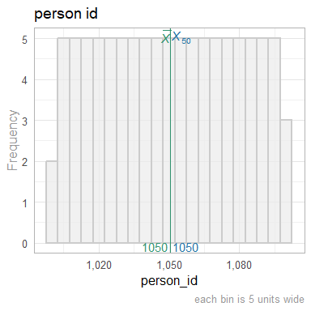
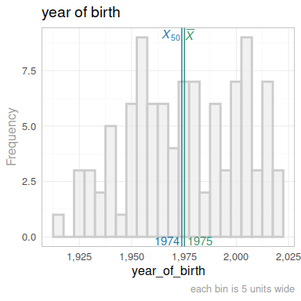
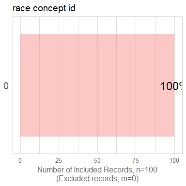
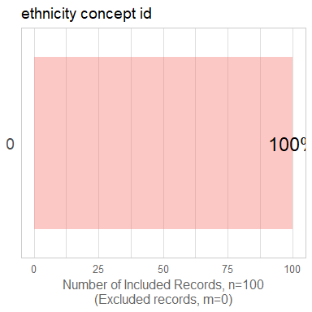
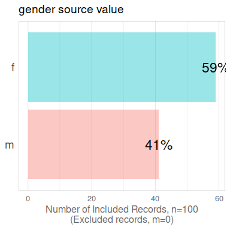
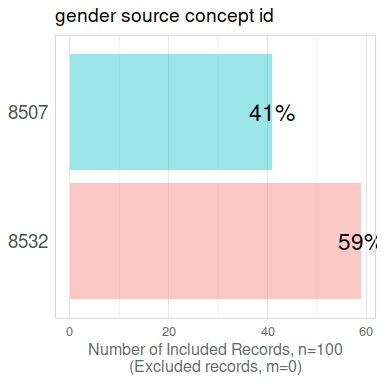

  This report covers the analyses used in the ZZZ project (Marcus Mark, PI).

<!--  Set the working directory to the repository's base directory; this assumes the report is nested inside of two directories.-->


<!-- Set the report-wide options, and point to the external code file. -->


<!-- Load 'sourced' R files.  Suppress the output when loading sources. -->


<!-- Load packages, or at least verify they're available on the local machine.  Suppress the output when loading packages. -->


<!-- Load any global functions and variables declared in the R file.  Suppress the output. -->


<!-- Declare any global functions specific to a Rmd output.  Suppress the output. -->


<!-- Load the datasets.   -->


<!-- Tweak the datasets.   -->


Summary {.tabset .tabset-fade .tabset-pills}
===========================================================================

Notes
---------------------------------------------------------------------------

1. The current report covers 100 patients, with 3 unique values for `data_partner_id`.


Unanswered Questions
---------------------------------------------------------------------------

Answered Questions
---------------------------------------------------------------------------


Marginals
===========================================================================

`person` table
---------------------------------------------------------------------------

<!-- --><!-- --><!-- --><!-- --><!-- --><!-- --><!-- --><!-- -->

`person_hidden` table
---------------------------------------------------------------------------

<!-- --><!-- --><!-- -->


Scatterplots
---------------------------------------------------------------------------


Correlation Matrixes
---------------------------------------------------------------------------


Models
===========================================================================

Model Exploration
---------------------------------------------------------------------------


Final Model
---------------------------------------------------------------------------


Session Information {#session-info}
===========================================================================

For the sake of documentation and reproducibility, the current report was rendered in the following environment.  Click the line below to expand.

  <details>
    <summary>Environment <span class="glyphicon glyphicon-plus-sign"></span></summary>
    
    ```
    ─ Session info ───────────────────────────────────────────────────────
     setting  value
     version  R version 4.2.2 Patched (2022-11-10 r83330)
     os       Ubuntu 23.04
     system   x86_64, linux-gnu
     ui       RStudio
     language (EN)
     collate  en_US.UTF-8
     ctype    en_US.UTF-8
     tz       America/Chicago
     date     2023-08-17
     rstudio  2023.06.1+524 Mountain Hydrangea (desktop)
     pandoc   3.1.5 @ /usr/bin/ (via rmarkdown)
    
    ─ Packages ───────────────────────────────────────────────────────────
     package         * version    date (UTC) lib source
     archive           1.1.5      2022-05-06 [1] CRAN (R 4.2.2)
     backports         1.4.1      2021-12-13 [1] CRAN (R 4.2.2)
     base            * 4.2.2      2023-02-04 [4] local
     bit               4.0.5      2022-11-15 [1] CRAN (R 4.2.2)
     bit64             4.0.5      2020-08-30 [1] CRAN (R 4.2.2)
     blob              1.2.4      2023-03-17 [1] CRAN (R 4.2.2)
     bslib             0.5.1      2023-08-11 [1] CRAN (R 4.2.2)
     cachem            1.0.8      2023-05-01 [1] CRAN (R 4.2.2)
     checkmate         2.2.0      2023-04-27 [1] CRAN (R 4.2.2)
     chron             2.3-61     2023-05-02 [1] CRAN (R 4.2.2)
     cli               3.6.1      2023-03-23 [1] CRAN (R 4.2.2)
     colorspace        2.1-0      2023-01-23 [1] CRAN (R 4.2.2)
     compiler          4.2.2      2023-02-04 [4] local
     config            0.3.1      2020-12-17 [1] CRAN (R 4.2.2)
     crayon            1.5.2      2022-09-29 [1] CRAN (R 4.2.2)
     datasets        * 4.2.2      2023-02-04 [4] local
     DBI               1.1.3      2022-06-18 [1] CRAN (R 4.2.2)
     digest            0.6.33     2023-07-07 [1] CRAN (R 4.2.2)
     dplyr             1.1.2      2023-04-20 [1] CRAN (R 4.2.2)
     evaluate          0.21       2023-05-05 [1] CRAN (R 4.2.2)
     fansi             1.0.4      2023-01-22 [1] CRAN (R 4.2.2)
     farver            2.1.1      2022-07-06 [1] CRAN (R 4.2.2)
     fastmap           1.1.1      2023-02-24 [1] CRAN (R 4.2.2)
     forcats           1.0.0      2023-01-29 [1] CRAN (R 4.2.2)
     generics          0.1.3      2022-07-05 [1] CRAN (R 4.2.2)
     ggplot2         * 3.4.3      2023-08-14 [1] CRAN (R 4.2.2)
     glue              1.6.2      2022-02-24 [1] CRAN (R 4.2.2)
     graphics        * 4.2.2      2023-02-04 [4] local
     grDevices       * 4.2.2      2023-02-04 [4] local
     grid              4.2.2      2023-02-04 [4] local
     gsubfn            0.7        2018-03-16 [1] CRAN (R 4.2.2)
     gtable            0.3.3      2023-03-21 [1] CRAN (R 4.2.2)
     highr             0.10       2022-12-22 [1] CRAN (R 4.2.2)
     hms               1.1.3      2023-03-21 [1] CRAN (R 4.2.2)
     htmltools         0.5.6      2023-08-10 [1] CRAN (R 4.2.2)
     jquerylib         0.1.4      2021-04-26 [1] CRAN (R 4.2.2)
     jsonlite          1.8.7      2023-06-29 [1] CRAN (R 4.2.2)
     knitr           * 1.43       2023-05-25 [1] CRAN (R 4.2.2)
     labeling          0.4.2      2020-10-20 [1] CRAN (R 4.2.2)
     lattice           0.21-8     2023-04-05 [1] CRAN (R 4.2.2)
     lifecycle         1.0.3      2022-10-07 [1] CRAN (R 4.2.2)
     lubridate         1.9.2      2023-02-10 [1] CRAN (R 4.2.2)
     magrittr          2.0.3      2022-03-30 [1] CRAN (R 4.2.2)
     Matrix            1.6-1      2023-08-14 [1] CRAN (R 4.2.2)
     memoise           2.0.1      2021-11-26 [1] CRAN (R 4.2.2)
     methods         * 4.2.2      2023-02-04 [4] local
     munsell           0.5.0      2018-06-12 [1] CRAN (R 4.2.2)
     odbc              1.3.5      2023-06-29 [1] CRAN (R 4.2.2)
     OuhscMunge        0.2.0.9015 2023-07-22 [1] local
     parallel          4.2.2      2023-02-04 [4] local
     pillar            1.9.0      2023-03-22 [1] CRAN (R 4.2.2)
     pkgconfig         2.0.3      2019-09-22 [1] CRAN (R 4.2.2)
     png               0.1-8      2022-11-29 [1] CRAN (R 4.2.2)
     proto             1.0.0      2016-10-29 [1] CRAN (R 4.2.2)
     purrr             1.0.2      2023-08-10 [1] CRAN (R 4.2.2)
     R6                2.5.1      2021-08-19 [1] CRAN (R 4.2.2)
     Rcpp              1.0.11     2023-07-06 [1] CRAN (R 4.2.2)
     readr             2.1.4      2023-02-10 [1] CRAN (R 4.2.2)
     reticulate        1.31       2023-08-10 [1] CRAN (R 4.2.2)
     rlang             1.1.1      2023-04-28 [1] CRAN (R 4.2.2)
     rmarkdown         2.24       2023-08-14 [1] CRAN (R 4.2.2)
     rsconnect         1.0.1      2023-07-20 [1] CRAN (R 4.2.2)
     RSQLite         * 2.3.1      2023-04-03 [1] CRAN (R 4.2.2)
     rstudioapi        0.15.0     2023-07-07 [1] CRAN (R 4.2.2)
     sass              0.4.7      2023-07-15 [1] CRAN (R 4.2.2)
     scales            1.2.1      2022-08-20 [1] CRAN (R 4.2.2)
     sessioninfo       1.2.2      2021-12-06 [1] CRAN (R 4.2.2)
     sqldf             0.4-11     2017-06-28 [1] CRAN (R 4.2.2)
     stats           * 4.2.2      2023-02-04 [4] local
     TabularManifest   0.2.1      2023-07-21 [1] Github (Melinae/TabularManifest@95daf4e)
     tcltk             4.2.2      2023-02-04 [4] local
     testit            0.13.1     2023-07-22 [1] Github (yihui/testit@7edc637)
     tibble            3.2.1      2023-03-20 [1] CRAN (R 4.2.2)
     tidyr             1.3.0      2023-01-24 [1] CRAN (R 4.2.2)
     tidyselect        1.2.0      2022-10-10 [1] CRAN (R 4.2.2)
     timechange        0.2.0      2023-01-11 [1] CRAN (R 4.2.2)
     tools             4.2.2      2023-02-04 [4] local
     tzdb              0.4.0      2023-05-12 [1] CRAN (R 4.2.2)
     utf8              1.2.3      2023-01-31 [1] CRAN (R 4.2.2)
     utils           * 4.2.2      2023-02-04 [4] local
     vctrs             0.6.3      2023-06-14 [1] CRAN (R 4.2.2)
     vroom             1.6.3      2023-04-28 [1] CRAN (R 4.2.2)
     withr             2.5.0      2022-03-03 [1] CRAN (R 4.2.2)
     xfun              0.40       2023-08-09 [1] CRAN (R 4.2.2)
     yaml              2.3.7      2023-01-23 [1] CRAN (R 4.2.2)
    
     [1] /home/wibeasley/R/x86_64-pc-linux-gnu-library/4.2
     [2] /usr/local/lib/R/site-library
     [3] /usr/lib/R/site-library
     [4] /usr/lib/R/library
    
    ──────────────────────────────────────────────────────────────────────
    ```
  </details>


Report rendered by wibeasley at 2023-08-17, 11:03 -0500 in 4 seconds.
