  This report covers the analyses used in the ZZZ project (Marcus Mark, PI).

<!--  Set the working directory to the repository's base directory; this assumes the report is nested inside of two directories.-->


<!-- Set the report-wide options, and point to the external code file. -->


<!-- Load 'sourced' R files.  Suppress the output when loading sources. -->


<!-- Load packages, or at least verify they're available on the local machine.  Suppress the output when loading packages. -->


<!-- Load any global functions and variables declared in the R file.  Suppress the output. -->


<!-- Declare any global functions specific to a Rmd output.  Suppress the output. -->


<!-- Load the datasets.   -->


<!-- Tweak the datasets.   -->


Summary {.tabset .tabset-fade .tabset-pills}
===========================================================================

Notes
---------------------------------------------------------------------------

1. The current report covers 1000 patients, with 3 unique values for `data_partner_id`.


Unanswered Questions
---------------------------------------------------------------------------

Answered Questions
---------------------------------------------------------------------------


Univariate
===========================================================================

`person` table
---------------------------------------------------------------------------

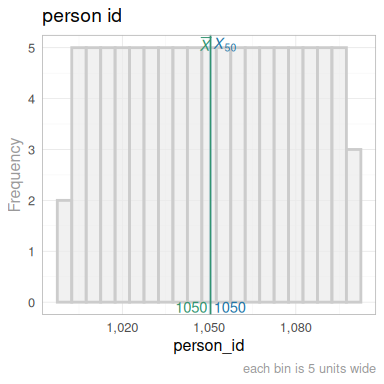<!-- --><!-- -->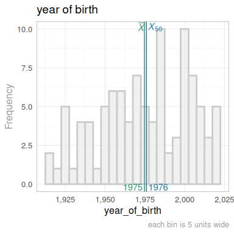<!-- --><!-- -->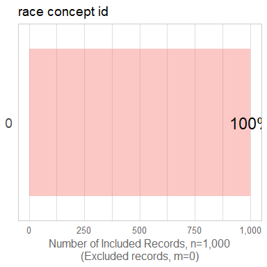<!-- -->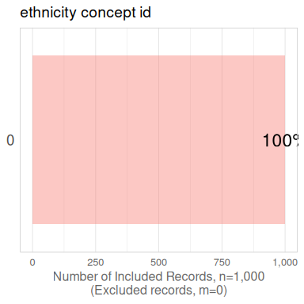<!-- -->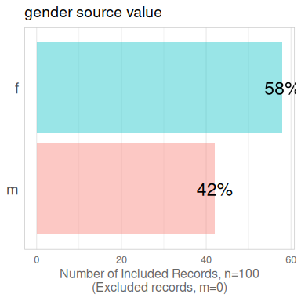<!-- -->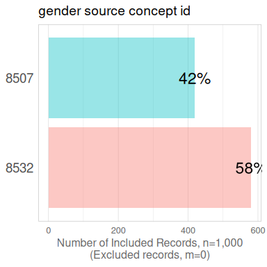<!-- -->

`patient` table
---------------------------------------------------------------------------

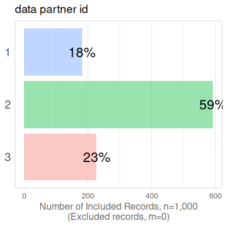<!-- -->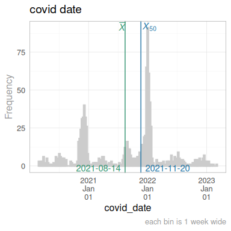<!-- --><!-- -->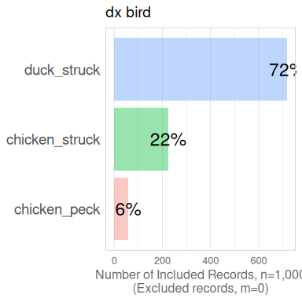<!-- -->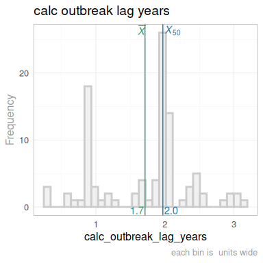<!-- -->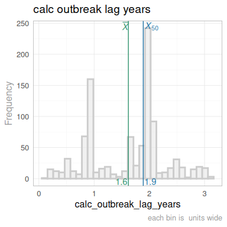<!-- -->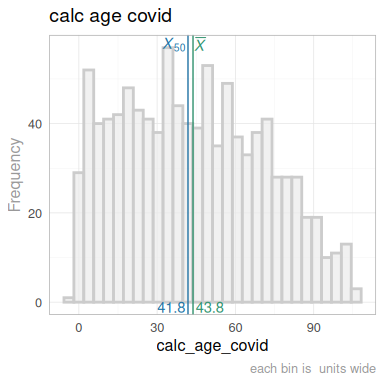<!-- -->

`patient_latent` table
---------------------------------------------------------------------------

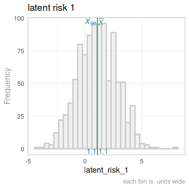<!-- -->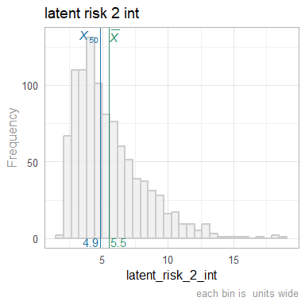<!-- -->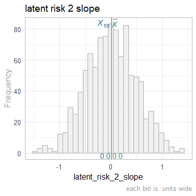<!-- -->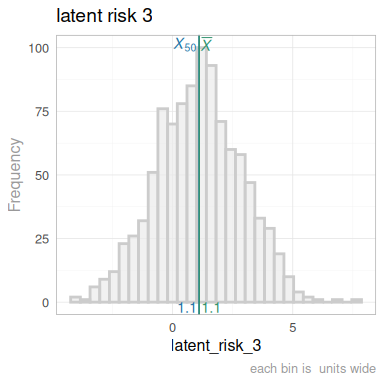<!-- -->

`site_latent` table
---------------------------------------------------------------------------

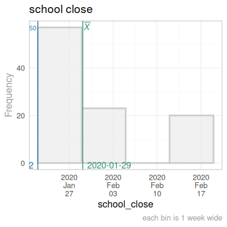<!-- -->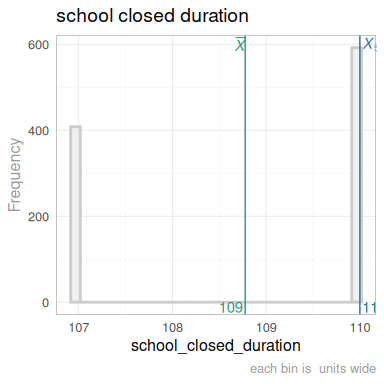<!-- -->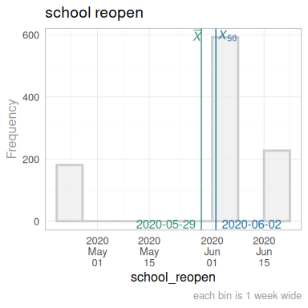<!-- -->


Multivariate
===========================================================================

latent risk 1
---------------------------------------------------------------------------

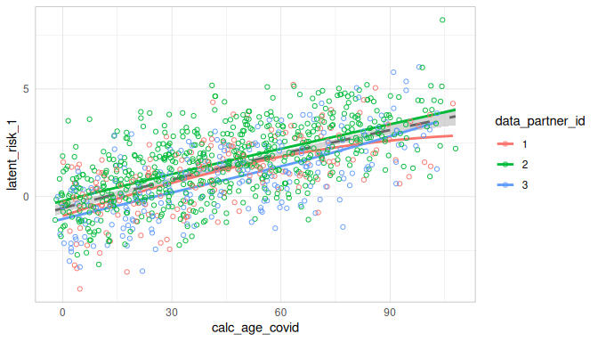<!-- -->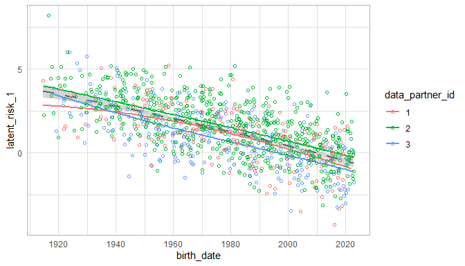<!-- -->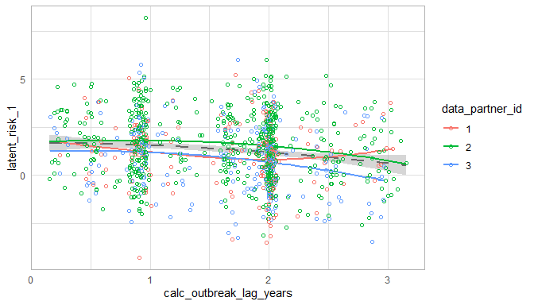<!-- -->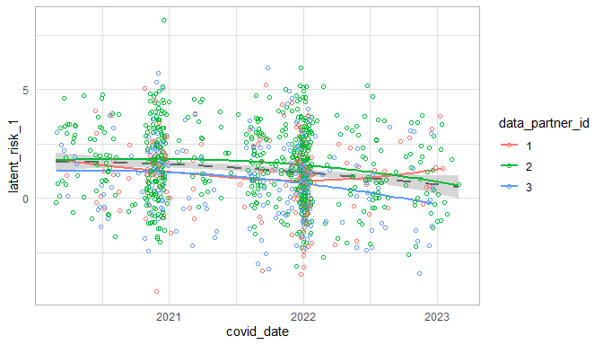<!-- -->

COVID Severity
---------------------------------------------------------------------------

<!-- -->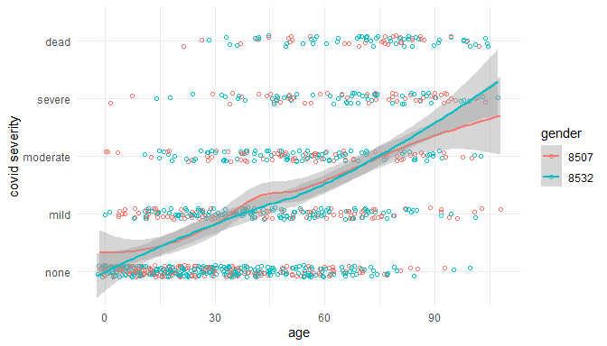<!-- -->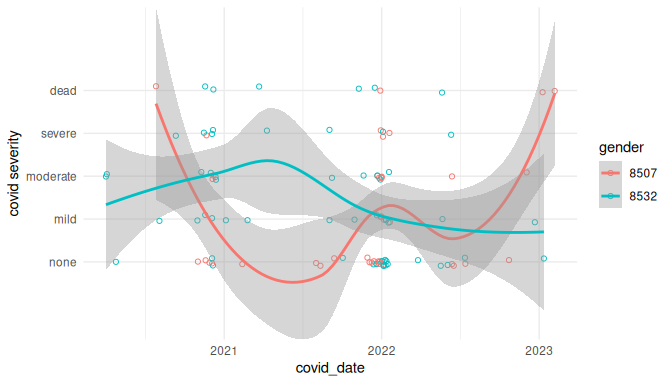<!-- -->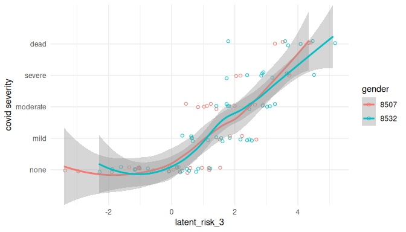<!-- -->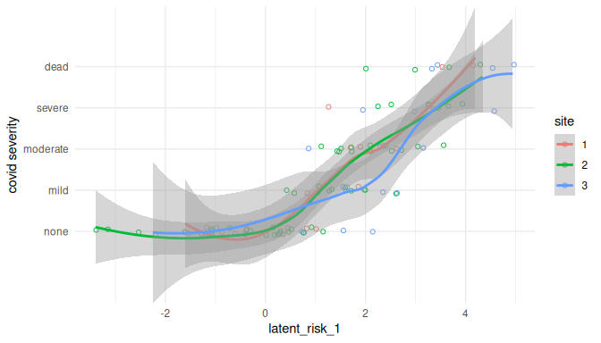<!-- -->

Correlation Matrixes
---------------------------------------------------------------------------

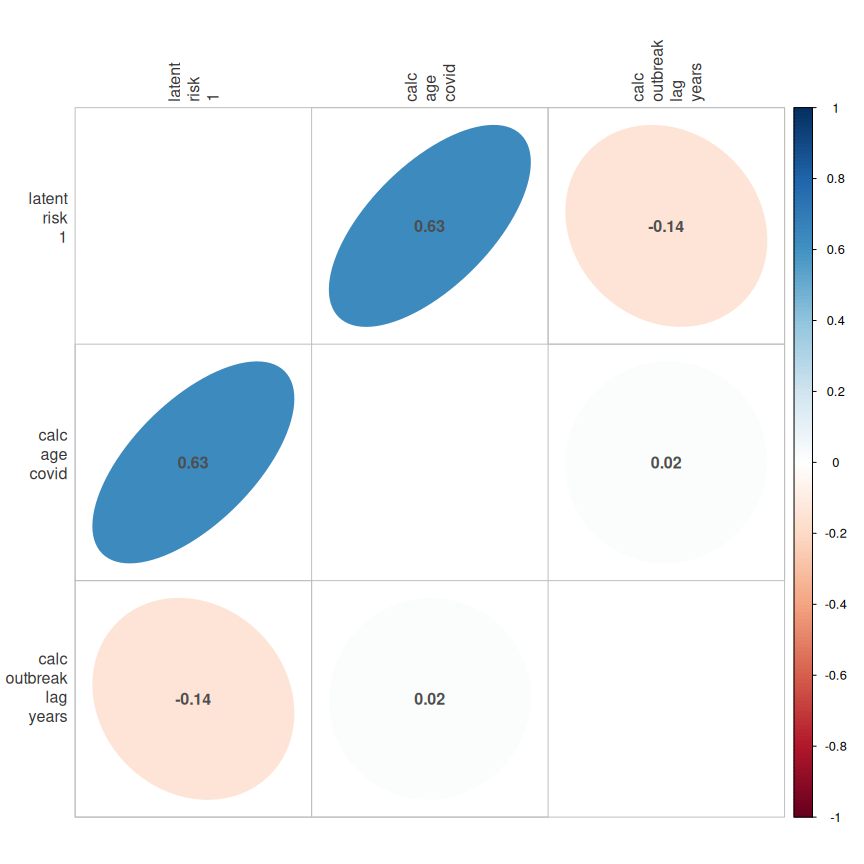<!-- -->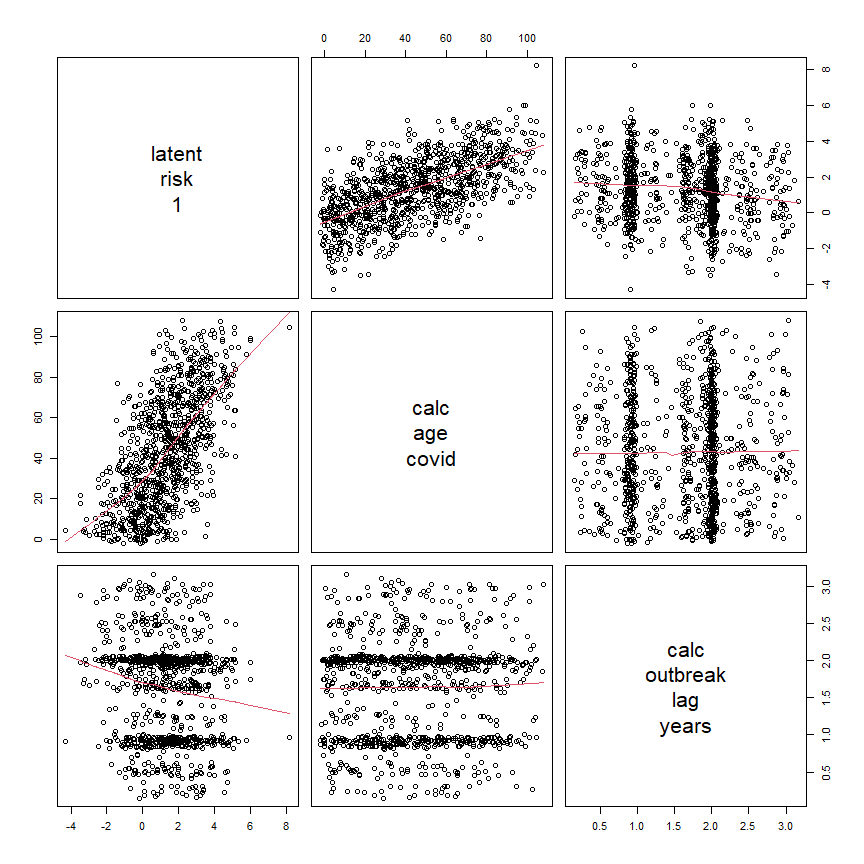<!-- -->

|                                 | latent<br>risk<br>1| calc<br>age<br>covid| calc<br>outbreak<br>lag<br>years|
|:--------------------------------|-------------------:|--------------------:|--------------------------------:|
|latent<br>risk<br>1              |               1.000|                0.622|                           -0.146|
|calc<br>age<br>covid             |               0.622|                1.000|                            0.020|
|calc<br>outbreak<br>lag<br>years |              -0.146|                0.020|                            1.000|


Models
===========================================================================

latent risk 1
---------------------------------------------------------------------------

### latent risk 1 -exploration


```
============= Simple model that's just an intercept. =============
```

```

Call:
lm(formula = latent_risk_1 ~ 1, data = ds_patient)

Residuals:
    Min      1Q  Median      3Q     Max 
-5.5814 -1.2332 -0.0314  1.2128  6.9016 

Coefficients:
            Estimate Std. Error t value Pr(>|t|)
(Intercept)  1.29943    0.05536   23.47   <2e-16

Residual standard error: 1.751 on 999 degrees of freedom
```

```
============= Model includes one predictor: `outbreak_lag`. =============
```

```

Call:
lm(formula = latent_risk_1 ~ 1 + calc_outbreak_lag_years, data = ds_patient)

Residuals:
    Min      1Q  Median      3Q     Max 
-5.8495 -1.2048 -0.0009  1.2127  6.6524 

Coefficients:
                        Estimate Std. Error t value Pr(>|t|)
(Intercept)              1.91096    0.14241  13.419  < 2e-16
calc_outbreak_lag_years -0.37745    0.08113  -4.652 3.73e-06

Residual standard error: 1.733 on 998 degrees of freedom
Multiple R-squared:  0.02123,	Adjusted R-squared:  0.02025 
F-statistic: 21.64 on 1 and 998 DF,  p-value: 3.725e-06
```

```
============= Model includes one predictor: `calc_age_covid`. =============
```

```

Call:
lm(formula = latent_risk_1 ~ 1 + calc_age_covid, data = ds_patient)

Residuals:
    Min      1Q  Median      3Q     Max 
-4.0358 -0.9307  0.0371  0.9366  4.4807 

Coefficients:
                Estimate Std. Error t value Pr(>|t|)
(Intercept)    -0.446531   0.082049  -5.442 6.62e-08
calc_age_covid  0.039901   0.001592  25.071  < 2e-16

Residual standard error: 1.372 on 998 degrees of freedom
Multiple R-squared:  0.3864,	Adjusted R-squared:  0.3858 
F-statistic: 628.5 on 1 and 998 DF,  p-value: < 2.2e-16
```

```
============= Model includes two predictors. =============
```

```

Call:
lm(formula = latent_risk_1 ~ 1 + calc_outbreak_lag_years + calc_age_covid, 
    data = ds_patient)

Residuals:
    Min      1Q  Median      3Q     Max 
-4.3062 -0.9752  0.0423  0.9112  4.3234 

Coefficients:
                        Estimate Std. Error t value Pr(>|t|)
(Intercept)              0.20777    0.12884   1.613    0.107
calc_outbreak_lag_years -0.40923    0.06296  -6.500 1.27e-10
calc_age_covid           0.04010    0.00156  25.706  < 2e-16

Residual standard error: 1.344 on 997 degrees of freedom
Multiple R-squared:  0.4114,	Adjusted R-squared:  0.4102 
F-statistic: 348.4 on 2 and 997 DF,  p-value: < 2.2e-16
```

### latent risk 1 -final


|                        | Estimate| Std. Error| t value| Pr(>&#124;t&#124;)|
|:-----------------------|--------:|----------:|-------:|------------------:|
|(Intercept)             |     0.21|       0.13|    1.61|               0.11|
|calc_outbreak_lag_years |    -0.41|       0.06|   -6.50|               0.00|
|calc_age_covid          |     0.04|       0.00|   25.71|               0.00|


Session Information {#session-info}
===========================================================================

For the sake of documentation and reproducibility, the current report was rendered in the following environment.  Click the line below to expand.

  <details>
    <summary>Environment <span class="glyphicon glyphicon-plus-sign"></span></summary>
    
    ```
    ─ Session info ───────────────────────────────────────────────────────────────────────────────────
     setting  value
     version  R version 4.3.2 Patched (2023-11-01 r85465 ucrt)
     os       Windows 11 x64 (build 22631)
     system   x86_64, mingw32
     ui       RStudio
     language (EN)
     collate  English_United States.utf8
     ctype    English_United States.utf8
     tz       America/Chicago
     date     2024-01-26
     rstudio  2023.06.1+524 Mountain Hydrangea (desktop)
     pandoc   3.1.5 @ C:/PROGRA~1/Pandoc/ (via rmarkdown)
    
    ─ Packages ───────────────────────────────────────────────────────────────────────────────────────
     ! package         * version    date (UTC) lib source
       archive           1.1.7.9000 2024-01-05 [1] Github (r-lib/archive@e07a493)
       arrow             14.0.0.2   2023-12-02 [1] CRAN (R 4.3.2)
       assertthat        0.2.1      2019-03-21 [1] CRAN (R 4.3.0)
       backports         1.4.1      2021-12-13 [1] CRAN (R 4.3.0)
       base            * 4.3.2      2023-11-02 [?] local
       bit               4.0.5      2022-11-15 [1] CRAN (R 4.3.0)
       bit64             4.0.5      2020-08-30 [1] CRAN (R 4.3.0)
       blob              1.2.4      2023-03-17 [1] CRAN (R 4.3.0)
       bslib             0.6.1      2023-11-28 [1] CRAN (R 4.3.2)
       cachem            1.0.8      2023-05-01 [1] CRAN (R 4.3.0)
       checkmate         2.3.1      2023-12-04 [1] CRAN (R 4.3.2)
       chron             2.3-61     2023-05-02 [1] CRAN (R 4.3.0)
       cli               3.6.2      2023-12-11 [1] CRAN (R 4.3.2)
       colorspace        2.1-0      2023-01-23 [1] CRAN (R 4.3.0)
     P compiler          4.3.2      2023-11-02 [3] local
       config            0.3.2      2023-08-30 [1] CRAN (R 4.3.1)
       corrplot          0.92       2021-11-18 [1] CRAN (R 4.3.0)
       crayon            1.5.2      2022-09-29 [1] CRAN (R 4.3.0)
     P datasets        * 4.3.2      2023-11-02 [3] local
       DBI               1.2.1      2024-01-12 [1] CRAN (R 4.3.2)
       digest            0.6.34     2024-01-11 [1] CRAN (R 4.3.2)
       dplyr             1.1.4      2023-11-17 [1] CRAN (R 4.3.2)
       duckdb            0.9.2-1    2023-11-28 [1] CRAN (R 4.3.2)
       evaluate          0.23       2023-11-01 [1] CRAN (R 4.3.2)
       fansi             1.0.6      2023-12-08 [1] CRAN (R 4.3.2)
       farver            2.1.1      2022-07-06 [1] CRAN (R 4.3.0)
       fastmap           1.1.1      2023-02-24 [1] CRAN (R 4.3.0)
       forcats           1.0.0      2023-01-29 [1] CRAN (R 4.3.0)
       fs                1.6.3      2023-07-20 [1] CRAN (R 4.3.1)
       generics          0.1.3      2022-07-05 [1] CRAN (R 4.3.0)
       ggplot2         * 3.4.4      2023-10-12 [1] CRAN (R 4.3.1)
       glue              1.7.0      2024-01-09 [1] CRAN (R 4.3.2)
     P graphics        * 4.3.2      2023-11-02 [3] local
     P grDevices       * 4.3.2      2023-11-02 [3] local
     P grid              4.3.2      2023-11-02 [3] local
       gsubfn            0.7        2018-03-16 [1] CRAN (R 4.3.0)
       gtable            0.3.4      2023-08-21 [1] CRAN (R 4.3.1)
       highr             0.10       2022-12-22 [1] CRAN (R 4.3.0)
       hms               1.1.3      2023-03-21 [1] CRAN (R 4.3.0)
       htmltools         0.5.7      2023-11-03 [1] CRAN (R 4.3.2)
       jquerylib         0.1.4      2021-04-26 [1] CRAN (R 4.3.0)
       jsonlite          1.8.8      2023-12-04 [1] CRAN (R 4.3.2)
       knitr           * 1.45       2023-10-30 [1] CRAN (R 4.3.2)
       labeling          0.4.3      2023-08-29 [1] CRAN (R 4.3.1)
       lattice           0.22-5     2023-10-24 [3] CRAN (R 4.3.2)
       lifecycle         1.0.4      2023-11-07 [1] CRAN (R 4.3.2)
       lubridate         1.9.3      2023-09-27 [1] CRAN (R 4.3.1)
       magrittr          2.0.3      2022-03-30 [1] CRAN (R 4.3.0)
       Matrix            1.6-5      2024-01-11 [1] CRAN (R 4.3.2)
       memoise           2.0.1      2021-11-26 [1] CRAN (R 4.3.0)
     P methods         * 4.3.2      2023-11-02 [3] local
       mgcv              1.9-1      2023-12-21 [2] CRAN (R 4.3.2)
       munsell           0.5.0      2018-06-12 [1] CRAN (R 4.3.0)
       nlme              3.1-164    2023-11-27 [2] CRAN (R 4.3.2)
       OuhscMunge        0.2.0.9016 2023-12-14 [1] local
     P parallel          4.3.2      2023-11-02 [3] local
       pillar            1.9.0      2023-03-22 [1] CRAN (R 4.3.0)
       pkgconfig         2.0.3      2019-09-22 [1] CRAN (R 4.3.0)
       proto             1.0.0      2016-10-29 [1] CRAN (R 4.3.0)
       purrr             1.0.2      2023-08-10 [1] CRAN (R 4.3.1)
       R6                2.5.1      2021-08-19 [1] CRAN (R 4.3.0)
       readr             2.1.5      2024-01-10 [1] CRAN (R 4.3.2)
       rlang             1.1.3      2024-01-10 [1] CRAN (R 4.3.2)
       rmarkdown         2.25       2023-09-18 [1] CRAN (R 4.3.1)
       RSQLite         * 2.3.4      2023-12-08 [1] CRAN (R 4.3.2)
       rstudioapi        0.15.0     2023-07-07 [1] CRAN (R 4.3.1)
       sass              0.4.8      2023-12-06 [1] CRAN (R 4.3.2)
       scales            1.3.0      2023-11-28 [1] CRAN (R 4.3.2)
       sessioninfo       1.2.2      2021-12-06 [1] CRAN (R 4.3.0)
     P splines           4.3.2      2023-11-02 [3] local
       sqldf             0.4-11     2017-06-28 [1] CRAN (R 4.3.0)
     P stats           * 4.3.2      2023-11-02 [3] local
       TabularManifest   0.2.1      2023-05-25 [1] Github (Melinae/TabularManifest@c50ae48)
     P tcltk             4.3.2      2023-11-02 [3] local
       testit            0.13       2021-04-14 [1] CRAN (R 4.3.0)
       tibble            3.2.1      2023-03-20 [1] CRAN (R 4.3.0)
       tidyr             1.3.0      2023-01-24 [1] CRAN (R 4.3.0)
       tidyselect        1.2.0      2022-10-10 [1] CRAN (R 4.3.0)
       timechange        0.3.0      2024-01-18 [1] CRAN (R 4.3.2)
     P tools             4.3.2      2023-11-02 [3] local
       tzdb              0.4.0      2023-05-12 [1] CRAN (R 4.3.0)
       utf8              1.2.4      2023-10-22 [1] CRAN (R 4.3.2)
     P utils           * 4.3.2      2023-11-02 [3] local
       vctrs             0.6.5      2023-12-01 [1] CRAN (R 4.3.2)
       vroom             1.6.5      2023-12-05 [1] CRAN (R 4.3.2)
       withr             3.0.0      2024-01-16 [1] CRAN (R 4.3.2)
       xfun              0.41       2023-11-01 [1] CRAN (R 4.3.2)
       yaml              2.3.8      2023-12-11 [1] CRAN (R 4.3.2)
    
     [1] D:/projects/r-libraries
     [2] C:/Users/wibea/AppData/Local/R/win-library/4.3
     [3] C:/Program Files/R/R-4.3.2patched/library
    
     P ── Loaded and on-disk path mismatch.
    
    ──────────────────────────────────────────────────────────────────────────────────────────────────
    ```
  </details>


Report rendered by wibea at 2024-01-26, 12:38 -0600 in 6 seconds.
